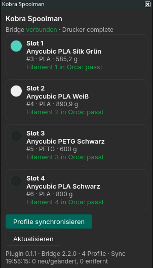
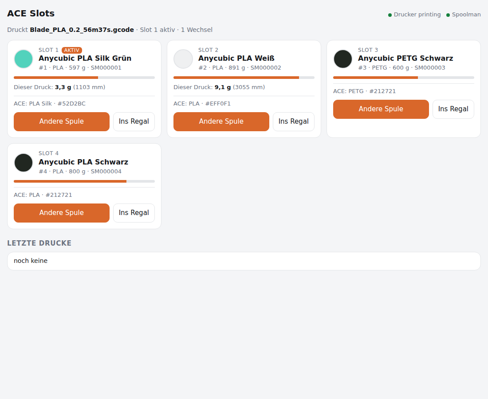
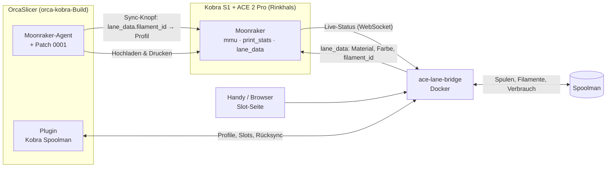

# kobra-spoolman

**Spoolman als einzige Quelle für alle Filamentdaten eines Anycubic Kobra S1 mit ACE 2 Pro – in OrcaSlicer und am Drucker.**

[English](README.md) · [Installation](docs/de/installation.md) · [Alltag](docs/de/usage.md) · [Fehlersuche](docs/de/troubleshooting.md)

---

Du trägst ein Filament **einmal** in [Spoolman](https://github.com/Donkie/Spoolman) ein – Temperaturen,
Lüfter, Hilfslüfter, Abluft, Flow, Pressure Advance, Retraction. Ab dann:

- **OrcaSlicer** hat ein passendes Filamentprofil, automatisch angelegt und aktuell gehalten.
- Die **ACE-Slots** wissen, welche Spule drin ist; ein Klick auf Orcas Sync-Knopf setzt die
  richtigen Profile in die richtigen Slots.
- Jeder Druck **bucht den Verbrauch pro Spule** in Spoolman – am Drucker gemessen, inklusive Spülen,
  auf den Millimeter genau.
- Änderst du ein Profil in Orca, landet die Änderung nach Rückfrage **in Spoolman**.
- Nach dem Slicen zeigt das Panel, **wie viel jede Spule braucht**, und warnt, wenn eine nicht reicht.

<table>
  <tr>
    <td align="center"> Orca-Panel: Slots, Spulen, Profilprüfung</td>
    <td align="center"> Slot-Seite: Spulen zuordnen, Verbrauch pro Slot live</td>
  </tr>
</table>

## So funktioniert es

| Baustein | Aufgabe |
|---|---|
| **[ace-lane-bridge](bridge/)** (Docker) | Verbindet Moonraker und Spoolman: Slot-Zuordnung (Handy-Seite), `lane_data` für Orca, Verbrauch messen und pro Spule buchen, Journal, offene Posten, Druckhistorie, Profil-Schnittstelle für Orca. |
| **[Kobra Spoolman](orca-plugin/)** (Orca-Plugin) | Legt pro Spoolman-Filament ein Orca-Profil an (`SM000010` …), Seitenpanel mit Slots und Profilprüfung, Verbrauchsvorschau nach dem Slicen, Rücksync von Profiländerungen nach Spoolman. |
| **[spoolman_setup.py](spoolman/)** | Richtet einmalig die Spoolman-Zusatzfelder (alle Orca-Filamenteinstellungen) und Materialvorlagen ein. |
| **[orca-kobra](https://github.com/xNoVoSx/orca-kobra)** (eigenes Repo) | Nächtliches OrcaSlicer-AppImage mit drei kleinen Patches: Profilwahl über `lane_data.filament_id` ([PR #14423](https://github.com/OrcaSlicer/OrcaSlicer/pull/14423)), ein Linux-Fix für die Plugin-Sandbox und lesender Zugriff auf die Slice-Statistik. Aktualisiert sich selbst. |

## Voraussetzungen

- Anycubic **Kobra S1** mit **ACE 2 Pro**, mit [Rinkhals](https://github.com/jbatonnet/Rinkhals) (Moonraker auf Port 7125).
- **Spoolman** ab 0.26.
- Ein **Docker**-Host im selben Netz (Portainer, Compose, …).
- **OrcaSlicer** mit Plugin-System (Nightly 2.5.0-dev). Die automatische Profilwahl braucht den
  `orca-kobra`-Build (Linux-AppImage), bis PR #14423 in Orca übernommen ist.

## Schnellstart

1. **Spoolman-Felder und Vorlagen** – einmalig:
   `python3 spoolman/spoolman_setup.py --url http://<spoolman-host>:7912`
2. **Bridge** – in den Spoolman-Stack aufnehmen ([Compose-Beispiel](bridge/compose.yaml)),
   `MOONRAKER_URL=http://<drucker-ip>:7125` setzen, `http://<docker-host>:7913` öffnen.
3. **OrcaSlicer** – den selbstaktualisierenden Build aus [orca-kobra](https://github.com/xNoVoSx/orca-kobra) installieren (`tools/install.sh`).
4. **Plugin** – [`kobra_spoolman.py`](orca-plugin/kobra_spoolman.py) nach
   `~/.config/OrcaSlicer/orca_plugins/kobra_spoolman/` kopieren, im Plugins-Dialog aktivieren, Bridge-Adresse eintragen.
5. Orca einmal neu starten – deine Spoolman-Filamente sind jetzt Orca-Profile.

Ausführlich: **[docs/de/installation.md](docs/de/installation.md)**.

## Im Alltag

1. Neues Filament → in Spoolman eintragen (Vorlage oder Orca-Basisprofil, dazu was du ändern willst).
2. Spule einlegen → auf der Slot-Seite dem Slot zuordnen (die Seite schlägt passende Spulen vor).
3. In Orca den **Sync-Knopf** drücken → die `SM…`-Profile stehen in Slot 1–4, das Panel bestätigt jeden Slot.
4. Drucken → der Verbrauch wird pro Spule gebucht, sichtbar auf der Slot-Seite und in Spoolman.
5. Profil in Orca ändern und speichern → bestätigen → die Änderung steht in Spoolman.

Mehr: **[docs/de/usage.md](docs/de/usage.md)**.

## Gemessene Genauigkeit

Ein echter Zweifarbdruck (4 Klingen weiß, Griff grün, ein Farbwechsel), abgespielt durch die
Verbrauchsmessung – die Aufzeichnung ist Teil der [Tests](tests/test_usage_replay.py):

| | Slot 2 (weiß) | Slot 1 (grün) |
|---|---|---|
| Orca, Modell | 2660 mm | 4830 mm |
| Gemessen, Modellanteil | **2659 mm** | **4829 mm** |
| Spülen (Firmware) | 451 mm beim Start | 195 mm beim Wechsel |
| **Gebucht in Spoolman** | **3055 mm ≈ 9,1 g** | **4970 mm ≈ 14,8 g** |

Die Summe stimmt exakt mit dem Zähler `filament_used` des Druckers überein. Mehr in [docs/findings.md](docs/findings.md) (englisch).

## Dokumentation

| | |
|---|---|
| [Installation](docs/de/installation.md) | Spoolman, Bridge (Docker/Portainer), Orca-Build, Plugin |
| [Alltag](docs/de/usage.md) | Filament eintragen, Slots zuordnen, drucken, offene Posten, Rücksync |
| [Spoolman-Felder](docs/spoolman-fields.md) | Welches Spoolman-Feld zu welcher Orca-Einstellung wird |
| [Konfiguration](docs/configuration.md) | Alle Umgebungsvariablen der Bridge und Plugin-Einstellungen (englisch) |
| [API](docs/api.md) | HTTP-Schnittstelle der Bridge (englisch) |
| [Architektur](docs/architecture.md) | Datenfluss, Verbrauchsrechnung, Profilaufbau, Entscheidungen (englisch) |
| [Erkenntnisse](docs/findings.md) | Messungen und Eigenheiten von Rinkhals, ACE und Orcas Plugin-API (englisch) |
| [Fehlersuche](docs/de/troubleshooting.md) | Häufige Probleme und Lösungen |
| [Änderungen](CHANGELOG.md) | Versionsverlauf |

## Fahrplan

| Etappe | Inhalt | Stand |
|---|---|---|
| 1 | Moonraker- und Spoolman-Anbindung, Slot-Seite, `lane_data`, Telemetrie | ✅ fertig |
| 2 | Verbrauch pro Spule, Journal, offene Posten, Sollwert-Abgleich, Historie | ✅ fertig |
| 3 | Orca-Profile aus Spoolman, Seitenpanel, Rücksync, gepatchter Orca-Build, Verbrauchsvorschau nach dem Slicen | ✅ fertig (Profile ohne Neustart zurückgestellt, siehe [Erkenntnisse](docs/findings.md)) |
| 4 | NFC-Tags: Spulen beim Einlegen erkennen | 🔜 geplant |
| 5 | Home Assistant über MQTT (Slots, Restgewicht, Meldungen) | 🔜 geplant |

## Danke

[OrcaSlicer](https://github.com/OrcaSlicer/OrcaSlicer) ·
[Spoolman](https://github.com/Donkie/Spoolman) ·
[Rinkhals](https://github.com/jbatonnet/Rinkhals) ·
Orca-PR [#14423](https://github.com/OrcaSlicer/OrcaSlicer/pull/14423) von Broncosis ·
[ACE-RFID](https://github.com/DnG-Crafts/ACE-RFID) ·
[SimplyPrint zum Anycubic-Tag-Format](https://help.simplyprint.io/en/article/the-anycubic-material-standard-nfcrfid-for-the-anycubic-ace-js3oty/)

## Lizenz

[MIT](LICENSE). Die OrcaSlicer-Patches liegen in [orca-kobra](https://github.com/xNoVoSx/orca-kobra) unter AGPL-3.0 wie OrcaSlicer selbst.
Kein offizielles Projekt von Anycubic, OrcaSlicer oder Spoolman.
