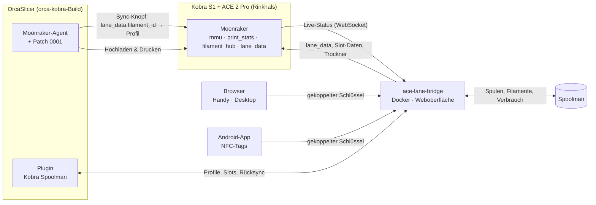

# kobra-spoolman

**Spoolman als einzige Quelle für alle Filamentdaten eines Anycubic Kobra S1 mit ACE 2 Pro – in OrcaSlicer, im Browser, auf dem Handy und am Drucker.**

[English](README.md) · [Installation](docs/de/installation.md) · [Alltag](docs/de/usage.md) · [Fehlersuche](docs/de/troubleshooting.md) · [API (englisch)](docs/api.md)

---

Du trägst ein Filament **einmal** in [Spoolman](https://github.com/Donkie/Spoolman) ein – Temperaturen,
Lüfter, Hilfslüfter, Abluft, Flow, Pressure Advance, Retraction. Ab dann:

- **OrcaSlicer** hat ein passendes Filamentprofil, automatisch angelegt und aktuell gehalten; ein
  Klick auf Orcas Sync-Knopf setzt die richtigen Profile in die richtigen ACE-Slots.
- Jeder Druck **bucht den Verbrauch pro Spule** in Spoolman – am Drucker gemessen, inklusive Spülen,
  auf den Millimeter genau.
- Eine **Weboberfläche** (Handy, Desktop, Ultrawide) und eine **Android-App** zeigen Drucker, die vier
  ACE-Slots und das Regal; du ordnest Spulen zu, legst Spulen und Filamente mit allen Orca-Werten an
  und steuerst den **ACE-Trockner** – ohne Spoolmans eigene Oberfläche.
- Änderst du ein Profil in Orca, landet die Änderung nach Rückfrage **in Spoolman**.
- Nach dem Slicen zeigt das Orca-Panel, **wie viel jede Spule braucht**, und warnt, wenn eine nicht reicht.

   
  Weboberfläche: der Druckermonitor – Kamera und Druckerdaten, Meldungen und Status, Trockner, ACE, die vier Slots

<table>
  <tr>
    <td align="center"> Weboberfläche auf dem Handy</td>
    <td align="center"> Android-App</td>
    <td align="center"> Orca-Seitenpanel</td>
  </tr>
</table>

## So funktioniert es

```mermaid
flowchart LR
    subgraph Printer["Kobra S1 + ACE 2 Pro (Rinkhals)"]
        MR[Moonraker<br/>mmu · print_stats · filament_hub · lane_data]
    end
    SM[(Spoolman)]
    BR[ace-lane-bridge<br/>Docker · Weboberfläche]
    subgraph PC["OrcaSlicer (orca-kobra-Build)"]
        AG[Moonraker-Agent<br/>+ Patch 0001]
        PL[Plugin<br/>Kobra Spoolman]
    end
    Web[Browser<br/>Handy · Desktop]
    App[Android-App<br/>NFC-Tags]

    MR -- "Live-Status (WebSocket)" --> BR
    BR -- "lane_data, Slot-Daten, Trockner" --> MR
    BR <-->|"Spulen, Filamente, Verbrauch"| SM
    Web -- "gekoppelter Schlüssel" --> BR
    App -- "gekoppelter Schlüssel" --> BR
    PL <-->|"Profile, Slots, Rücksync"| BR
    AG -- "Sync-Knopf: lane_data.filament_id → Profil" --> MR
    AG -- "Hochladen & Drucken" --> MR
```

Die Bridge ist der **einzige** Client dieses Projekts am Drucker (der Kobra S1 verträgt nur wenige
Moonraker-Clients); Browser, App und Orca-Plugin reden alle mit der Bridge.

| Baustein | Aufgabe |
|---|---|
| **[ace-lane-bridge](bridge/)** (Docker) | Verbindet Moonraker und Spoolman. Weboberfläche, Slot-Zuordnung, `lane_data` für Orca, Verbrauch messen und pro Spule buchen, offene Posten, Druckhistorie, Trockner-Automatik, Geräte koppeln, Schnittstelle für App und Plugin. |
| **[Kobra Spoolman](orca-plugin/)** (Orca-Plugin) | Ein Orca-Filamentprofil pro Spoolman-Filament (`SM000010` …), Seitenpanel mit Slots und Profilprüfung, Verbrauchsvorschau nach dem Slicen, Rücksync von Profiländerungen nach Spoolman. |
| **[Android-App](android/)** (Vorschau) | Slots, Spulenkarte, neue Spulen und Filamente, ACE-Trockner, schreibt ACE-taugliche NFC-Tags, Koppeln per QR-Code. |
| **[spoolman_setup.py](spoolman/)** | Legt einmalig die Spoolman-Zusatzfelder (alle Orca-Filamentwerte) und Materialvorlagen an. |
| **[orca-kobra](https://github.com/xNoVoSx/orca-kobra)** (eigenes Repo) | Nächtliches OrcaSlicer-AppImage mit drei kleinen Patches: Profilwahl über `lane_data.filament_id` ([PR #14423](https://github.com/OrcaSlicer/OrcaSlicer/pull/14423)), eine Korrektur der Plugin-Sandbox unter Linux und Slice-Statistik für Plugins. Aktualisiert sich selbst. |

## Voraussetzungen

- Anycubic **Kobra S1** mit **ACE 2 Pro**, gerootet mit [Rinkhals](https://github.com/rinkhals-community/Rinkhals) (Moonraker auf Port 7125 erreichbar).
- **Spoolman** 0.26 oder neuer.
- Ein **Docker**-Host im selben Netz (Portainer, Compose, …).
- **OrcaSlicer** mit Plugin-System (2.5.0-dev nightly). Die automatische Profilwahl braucht den
  `orca-kobra`-Build (Linux-AppImage), bis PR #14423 in Orca übernommen ist.
- Optional: ein Android-Handy (ab Android 10) mit NFC für die App.

## Schnellstart

1. **Spoolman-Felder und Vorlagen** – einmalig:
   `python3 spoolman/spoolman_setup.py --url http://<spoolman-host>:7912`
2. **Bridge** – in den Spoolman-Stack aufnehmen ([Compose-Beispiel](bridge/compose.yaml)) mit
   `MOONRAKER_URL=http://<drucker-ip>:7125`.
3. **Browser koppeln** – `http://<docker-host>:7913` öffnen und den Einrichtungscode aus dem
   Bridge-Log eingeben (`Einrichtungscode: …`). Weitere Geräte bekommen einen Code unter
   *Geräte → Gerät hinzufügen*.
4. **OrcaSlicer** – den selbst aktualisierenden Build von [orca-kobra](https://github.com/xNoVoSx/orca-kobra) installieren (`tools/install.sh`).
5. **Plugin** – [`kobra_spoolman.py`](orca-plugin/kobra_spoolman.py) nach
   `~/.config/OrcaSlicer/orca_plugins/kobra_spoolman/` kopieren, aktivieren, Bridge-Adresse eintragen
   und im Panel einen Kopplungscode eingeben. Orca einmal neu starten – deine Spoolman-Filamente sind jetzt Orca-Profile.

Ausführlich: **[docs/de/installation.md](docs/de/installation.md)**.

## Im Alltag

1. Neues Filament → in der Weboberfläche oder App anlegen (oder in Spoolman): Vorlage oder
   Orca-Basisprofil, dazu nur, was du abweichend willst.
2. Spule einlegen → in der Weboberfläche oder App dem Slot zuordnen; Spulen, die zu dem passen, was
   die ACE meldet, stehen oben. Bei Spulen ohne Anycubic-Tag gehen Material und Farbe ans Druckerdisplay.
3. In Orca den Filament-**Sync**-Knopf drücken → die `SM…`-Profile landen in Slot 1–4.
4. Drucken → der Verbrauch wird pro Spule gebucht, live in der Weboberfläche und in Spoolman.
5. Profil in Orca anpassen und speichern → bestätigen → die Änderung steht in Spoolman.

Mehr: **[docs/de/usage.md](docs/de/usage.md)**.

## Ansichten

<table>
  <tr>
    <td align="center"> Regal: suchen, filtern, Spule bearbeiten, in einen Slot legen</td>
    <td align="center"> Filament-Editor: alle Orca-Werte, Vorlagenwerte als Platzhalter</td>
  </tr>
  <tr>
    <td align="center"> ACE-Trockner: Automatik nach Feuchte, nie heißer als die empfindlichste Spule</td>
    <td align="center"> Geräte: ein Schlüssel pro Gerät, Koppeln per Code oder QR</td>
  </tr>
</table>

Auf einem 5120×1440-Ultrawide steht alles nebeneinander – Drucker, Slots, Regal, Spulendetails und Drucke:

## Gemessene Genauigkeit

Ein echter Zweifarbdruck (4 Klingen weiß, Griff grün, ein Farbwechsel), nachgespielt durch die
Verbrauchsmessung – die Aufzeichnung ist Teil der [Tests](tests/test_usage_replay.py):

| | Slot 2 (weiß) | Slot 1 (grün) |
|---|---|---|
| Orca-Modelllänge | 2660 mm | 4830 mm |
| Gemessener Modellanteil | **2659 mm** | **4829 mm** |
| Spülen (Firmware) | 451 mm beim Start | 195 mm beim Wechsel |
| **In Spoolman gebucht** | **3055 mm ≈ 9,1 g** | **4970 mm ≈ 14,8 g** |

Die Summe stimmt exakt mit dem Zähler `filament_used` des Druckers überein. Mehr in [docs/findings.md](docs/findings.md) (englisch).

## Sicherheit

Lesen ist im Heimnetz offen. Alles, was etwas ändert – Spoolman, Slot-Zuordnung, offene Posten,
Trockner, Orca-Rücksync – braucht ein **gekoppeltes Gerät**: Die Bridge vergibt einen Schlüssel pro
Browser, Handy und Orca-Plugin, speichert nur dessen Hash und lässt dich Geräte jederzeit entfernen.
Die Bridge gehört ins Heimnetz; sie hat kein TLS.

## Dokumentation

| | |
|---|---|
| [Installation](docs/de/installation.md) | Spoolman, Bridge (Docker/Portainer), Koppeln, Orca-Build, Plugin, App |
| [Im Alltag](docs/de/usage.md) | Weboberfläche und App, Filamente, Slots, Drucken, Trockner, offene Posten, Rücksync |
| [Fehlersuche](docs/de/troubleshooting.md) | Häufige Probleme und Lösungen |
| [Spoolman-Felder](docs/spoolman-fields.md) | Welches Spoolman-Feld zu welcher Orca-Einstellung wird (englisch) |
| [Konfiguration](docs/configuration.md) | Alle Umgebungsvariablen der Bridge und Plugin-Einstellungen (englisch) |
| [API](docs/api.md) | HTTP-Schnittstelle der Bridge (englisch) |
| [Architektur](docs/architecture.md) | Datenfluss, Verbrauchsmessung, Profilauflösung, Koppeln (englisch) |
| [Android-App](docs/android-app.md) | Was die App kann, NFC-Tags, bauen (englisch) |
| [Befunde](docs/findings.md) | Was wir über Rinkhals, die ACE und Orcas Plugin-API gemessen haben (englisch) |
| [Changelog](CHANGELOG.md) | Versionsgeschichte (englisch) |

## Fahrplan

| Etappe | Inhalt | Stand |
|---|---|---|
| 1 | Moonraker- und Spoolman-Anbindung, Slot-Zuordnung, `lane_data`, Telemetrie | ✅ fertig |
| 2 | Verbrauch pro Spule, Journal, offene Posten, Soll-Abgleich, Historie | ✅ fertig |
| 3 | Orca-Profile aus Spoolman, Seitenpanel, Rücksync, gepatchter Orca-Build, Verbrauchsvorschau nach dem Slicen | ✅ fertig (Profile ohne Neustart nachladen ist zurückgestellt, siehe [Befunde](docs/findings.md)) |
| 4 | Weboberfläche, Android-App, Koppeln, ACE-Trockner, NFC-Tags | ✅ Weboberfläche, Koppeln, Trockner · 🧪 App (Vorschau) · 🔜 Spulen beim Einlegen am Tag erkennen |
| – | Spülen pro Farbwechsel: Spülmenge der Firmware pro Übergang lernen, für genaue Buchung und Vorschau | 🔜 geplant |
| 5 | Home Assistant über MQTT (Slots, Restgewicht, Meldungen) | 🔜 geplant |

## Dank

[OrcaSlicer](https://github.com/OrcaSlicer/OrcaSlicer) ·
[Spoolman](https://github.com/Donkie/Spoolman) ·
[Rinkhals](https://github.com/rinkhals-community/Rinkhals) ·
Orca-PR [#14423](https://github.com/OrcaSlicer/OrcaSlicer/pull/14423) von Broncosis ·
[ACE-RFID](https://github.com/DnG-Crafts/ACE-RFID) ·
[SimplyPrints Notizen zum Anycubic-Tagformat](https://help.simplyprint.io/en/article/the-anycubic-material-standard-nfcrfid-for-the-anycubic-ace-js3oty/) ·
[Preact](https://preactjs.com/) + [htm](https://github.com/developit/htm) ·
[qrcode-generator](https://github.com/kazuhikoarase/qrcode-generator) ·
Schriften [Space Grotesk](https://github.com/floriankarsten/space-grotesk) und [IBM Plex](https://github.com/IBM/plex)

## Lizenz

[MIT](LICENSE). Mitgelieferte Fremddateien behalten ihre Lizenzen (`bridge/app/acebridge/static/licenses`, `android/licenses`).
Die OrcaSlicer-Patches liegen in [orca-kobra](https://github.com/xNoVoSx/orca-kobra) unter AGPL-3.0, wie OrcaSlicer selbst.
Kein offizielles Projekt von Anycubic, OrcaSlicer oder Spoolman.
