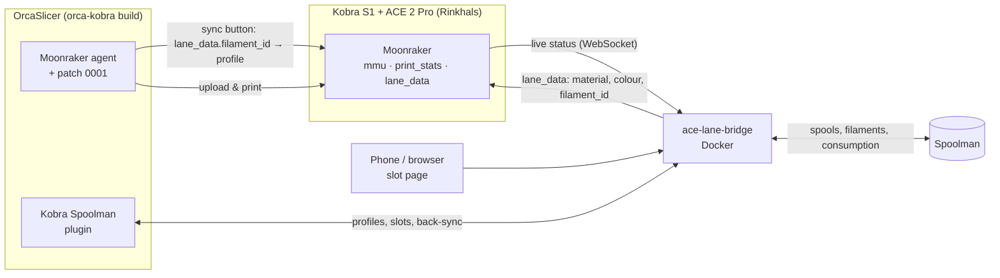

# kobra-spoolman

**Spoolman as the single source of truth for an Anycubic Kobra S1 with ACE 2 Pro — in OrcaSlicer and on the printer.**

[Deutsch](README.de.md) · [Installation](docs/installation.md) · [Daily use](docs/usage.md) · [API](docs/api.md) · [Architecture](docs/architecture.md)

---

You enter a filament **once** in [Spoolman](https://github.com/Donkie/Spoolman) — temperatures, fans,
aux fan, exhaust fan, flow, pressure advance, retraction. From then on:

- **OrcaSlicer** has a matching filament profile, created and kept up to date automatically.
- The **ACE slots** know which spool is loaded; one click on Orca's sync button puts the right
  profiles into the right slots.
- Every print **books the consumption per spool** into Spoolman — measured on the printer,
  including purge, accurate to the millimetre.
- Changes you make to a profile in Orca are **written back to Spoolman** after you confirm.
- After slicing, the panel shows **what each spool needs** for the plate and warns if one is too short.

<table>
  <tr>
    <td align="center"> Orca side panel: slots, spools, profile check</td>
    <td align="center"> Slot page: assign spools, live consumption per slot</td>
  </tr>
</table>

## How it works

| Component | What it does |
|---|---|
| **[ace-lane-bridge](bridge/)** (Docker) | Connects Moonraker and Spoolman. Slot ↔ spool assignment (mobile page), writes `lane_data` for Orca, measures and books consumption per spool, journal, open items, print history, Orca profile API. |
| **[Kobra Spoolman](orca-plugin/)** (Orca plugin) | Creates one Orca filament profile per Spoolman filament (`SM000010` …), side panel with slots and profile check, usage preview after slicing, back-sync of profile edits to Spoolman. |
| **[spoolman_setup.py](spoolman/)** | One-time setup of the Spoolman extra fields (all Orca filament settings) and material templates. |
| **[orca-kobra](https://github.com/xNoVoSx/orca-kobra)** (separate repo) | Nightly OrcaSlicer AppImage with three small patches: preset matching via `lane_data.filament_id` ([PR #14423](https://github.com/OrcaSlicer/OrcaSlicer/pull/14423)), a Linux plugin-sandbox fix and read-only slice statistics for plugins. Updates itself. |

## Requirements

- Anycubic **Kobra S1** with **ACE 2 Pro**, rooted with [Rinkhals](https://github.com/jbatonnet/Rinkhals) (Moonraker reachable on port 7125).
- **Spoolman** 0.26 or newer.
- A **Docker** host in the same network (Portainer, Compose, …).
- **OrcaSlicer** with the plugin system (2.5.0-dev nightly). Automatic profile selection needs the
  `orca-kobra` build (Linux AppImage) until PR #14423 is merged upstream.

> [!NOTE]
> The user interfaces (slot page, Orca panel) are currently German. The code and API are language-neutral; translations are welcome.

## Quick start

1. **Spoolman fields and templates** — once:
   `python3 spoolman/spoolman_setup.py --url http://<spoolman-host>:7912`
2. **Bridge** — add it to your Spoolman stack ([compose example](bridge/compose.yaml)) and set
   `MOONRAKER_URL=http://<printer-ip>:7125`. Open `http://<docker-host>:7913`.
3. **OrcaSlicer** — install the self-updating build from [orca-kobra](https://github.com/xNoVoSx/orca-kobra) (`tools/install.sh`).
4. **Plugin** — copy [`kobra_spoolman.py`](orca-plugin/kobra_spoolman.py) to
   `~/.config/OrcaSlicer/orca_plugins/kobra_spoolman/`, enable it in the Plugins dialog and set the bridge address.
5. Restart Orca once — your Spoolman filaments are now Orca profiles.

Full guide: **[docs/installation.md](docs/installation.md)**.

## Daily use

1. New filament → enter it in Spoolman (template or an Orca base profile, plus whatever you want to override).
2. Load the spool → assign it to its slot on the slot page (the page suggests spools that match what the ACE reports).
3. In Orca press the filament **sync** button → the `SM…` profiles land in slots 1–4; the panel confirms each slot.
4. Print → consumption is booked per spool, visible on the slot page and in Spoolman.
5. Tweak a profile in Orca and save → confirm → the change is stored in Spoolman.

Details: **[docs/usage.md](docs/usage.md)**.

## Measured accuracy

A real two-colour print (4 blades white, handle green, one colour change) replayed through the
consumption tracker — this recording is part of the [test suite](tests/test_usage_replay.py):

| | Slot 2 (white) | Slot 1 (green) |
|---|---|---|
| Orca model length | 2660 mm | 4830 mm |
| Measured model part | **2659 mm** | **4829 mm** |
| Purge (firmware) | 451 mm at start | 195 mm at the change |
| **Booked in Spoolman** | **3055 mm ≈ 9.1 g** | **4970 mm ≈ 14.8 g** |

The sum matches the printer's `filament_used` counter exactly. More in [docs/findings.md](docs/findings.md).

## Documentation

| | |
|---|---|
| [Installation](docs/installation.md) | Spoolman, bridge (Docker/Portainer), Orca build, plugin |
| [Daily use](docs/usage.md) | Entering filaments, assigning slots, printing, open items, back-sync |
| [Spoolman fields](docs/spoolman-fields.md) | Which Spoolman field becomes which Orca setting |
| [Configuration](docs/configuration.md) | All bridge environment variables and plugin settings |
| [API](docs/api.md) | HTTP API of the bridge |
| [Architecture](docs/architecture.md) | Data flow, consumption algorithm, profile resolution, design decisions |
| [Findings](docs/findings.md) | What we measured and learned about Rinkhals, the ACE and Orca's plugin API |
| [Troubleshooting](docs/troubleshooting.md) | Common problems and how to solve them |
| [Changelog](CHANGELOG.md) | Version history |

## Roadmap

| Stage | Content | Status |
|---|---|---|
| 1 | Moonraker + Spoolman connection, slot page, `lane_data`, telemetry | ✅ done |
| 2 | Consumption per spool, journal, open items, target comparison, history | ✅ done |
| 3 | Orca profiles from Spoolman, side panel, back-sync, patched Orca build, usage preview after slicing | ✅ done (reloading profiles without a restart is deferred, see [findings](docs/findings.md)) |
| 4 | NFC tags: recognise spools when they are loaded | 🔜 planned |
| 5 | Home Assistant via MQTT (slots, remaining weight, notifications) | 🔜 planned |

## Credits

[OrcaSlicer](https://github.com/OrcaSlicer/OrcaSlicer) ·
[Spoolman](https://github.com/Donkie/Spoolman) ·
[Rinkhals](https://github.com/jbatonnet/Rinkhals) ·
Orca PR [#14423](https://github.com/OrcaSlicer/OrcaSlicer/pull/14423) by Broncosis ·
[ACE-RFID](https://github.com/DnG-Crafts/ACE-RFID) ·
[SimplyPrint's notes on the Anycubic tag format](https://help.simplyprint.io/en/article/the-anycubic-material-standard-nfcrfid-for-the-anycubic-ace-js3oty/)

## License

[MIT](LICENSE). The OrcaSlicer patches live in [orca-kobra](https://github.com/xNoVoSx/orca-kobra) under AGPL-3.0, like OrcaSlicer itself.
Not affiliated with Anycubic, OrcaSlicer or Spoolman.
