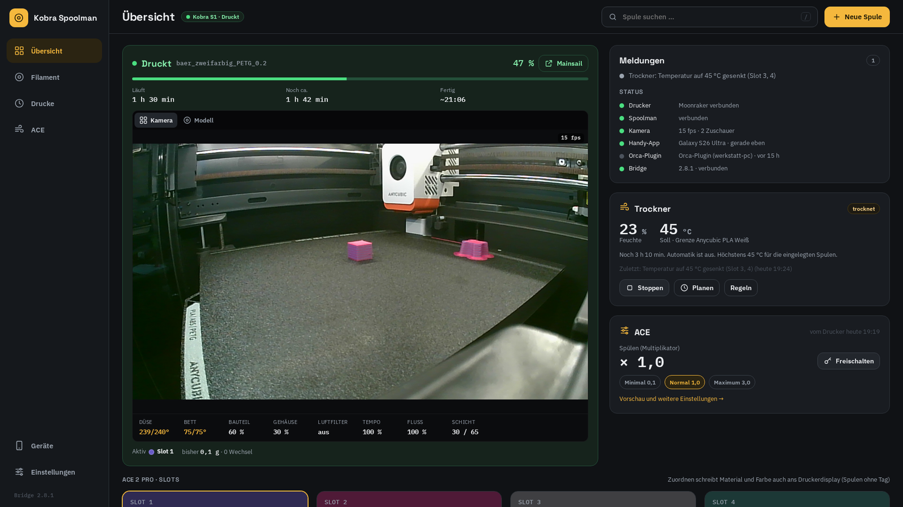
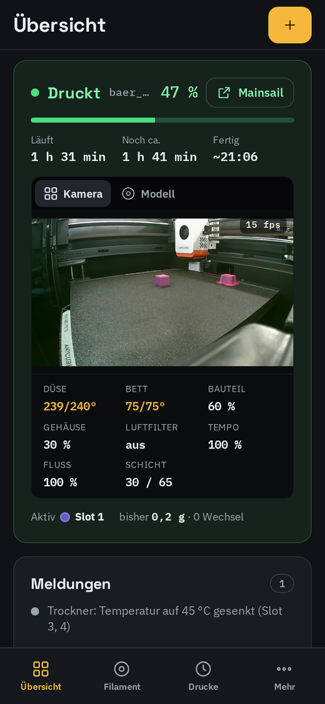
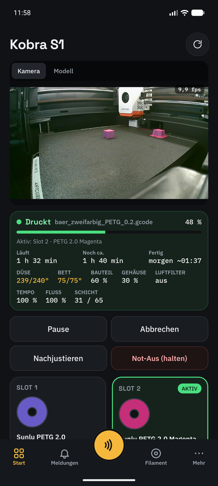
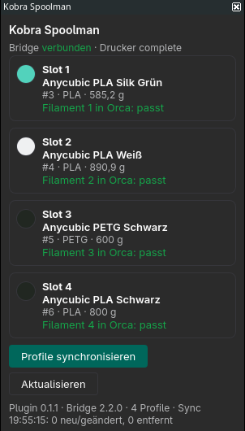
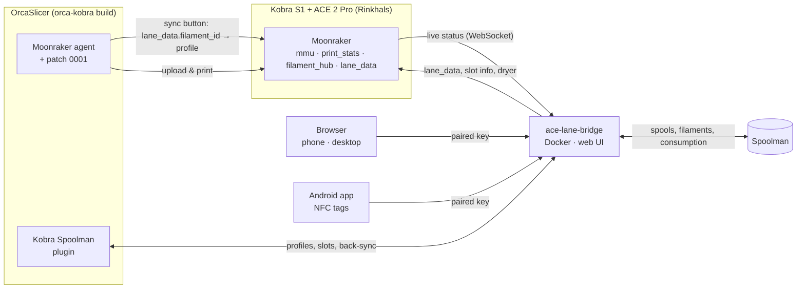
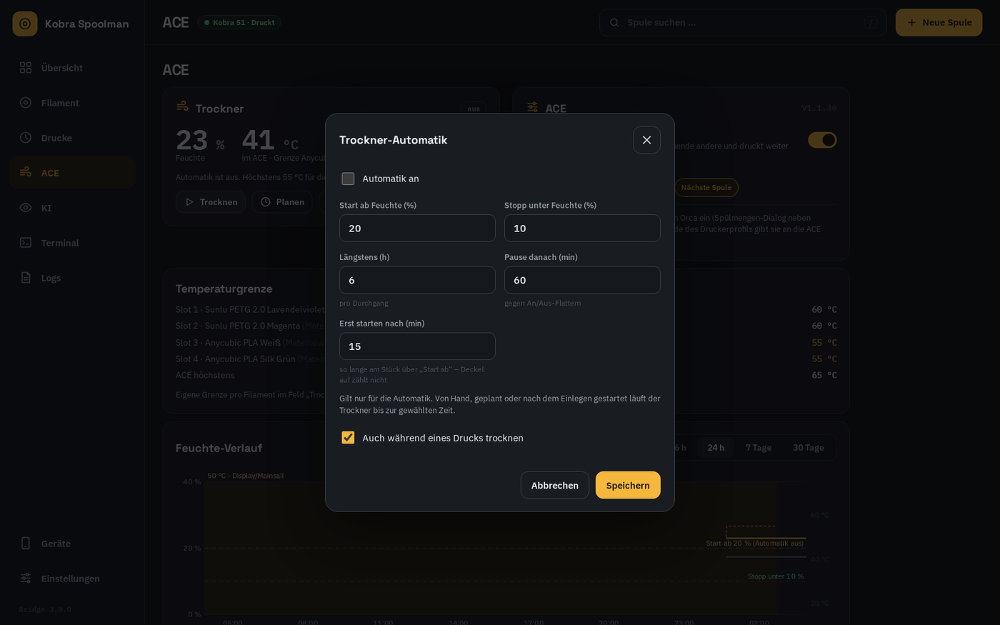
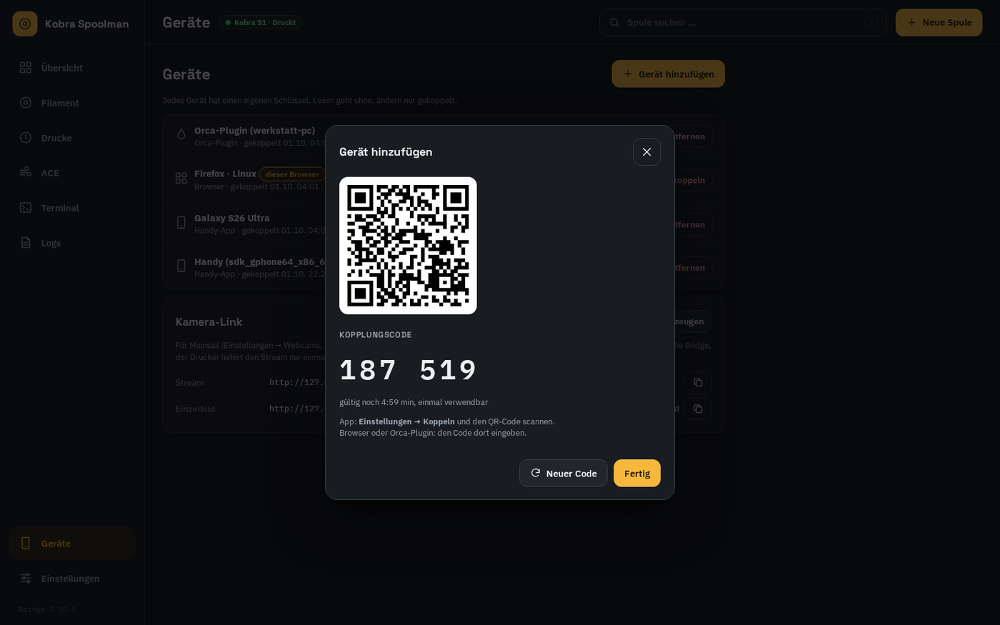
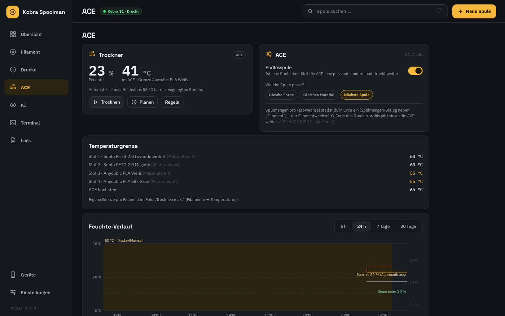
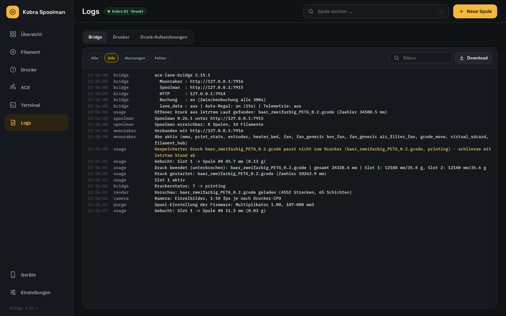
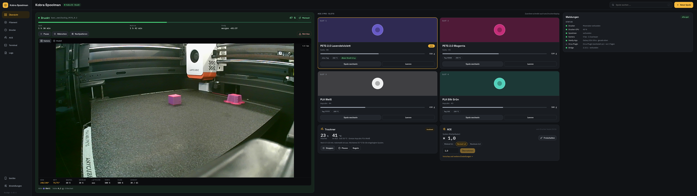

# kobra-spoolman

**Spoolman as the single source of truth for an Anycubic Kobra S1 with ACE 2 Pro — in OrcaSlicer, in the browser, on your phone and on the printer.**

[Deutsch](README.de.md) · [Installation](docs/installation.md) · [Daily use](docs/usage.md) · [Troubleshooting](docs/troubleshooting.md) · [API](docs/api.md)

---

You enter a filament **once** in [Spoolman](https://github.com/Donkie/Spoolman) — temperatures, fans,
aux fan, exhaust fan, flow, pressure advance, retraction. From then on:

- **OrcaSlicer** has a matching filament profile, created and kept up to date automatically, and
  one click on Orca's sync button puts the right profiles into the right ACE slots.
- Every print **books the consumption per spool** into Spoolman — measured on the printer,
  including purge, accurate to the millimetre.
- A **web UI** (phone, desktop, ultrawide) and an **Android app** show the printer, the four ACE
  slots and the shelf; you assign spools, create spools and filaments with all Orca settings and
  control the **ACE dryer** — without touching Spoolman's own UI.
- Changes you make to a profile in Orca are **written back to Spoolman** after you confirm.
- After slicing, the Orca panel shows **what each spool needs** for the plate and warns if one is too short.
- The bridge is also a **printer monitor that replaces OctoApp**: camera restream that spares the
  printer's CPU, pause/cancel/fine-tuning, terminal and logs, notifications on the phone — and
  spools with our NFC tags are **assigned to their slot by themselves** when loaded.
- An optional **AI** watches running prints and raises an alarm with a camera picture when a print
  turns into spaghetti — on the CPU, without any load on the printer ([vision.md](docs/vision.md)).
- The bridge **keeps track of how wet every spool is** — ACE humidity history, every drying, a
  moisture estimate per spool from where it was — dries spools by itself when they are loaded and
  checks at print start whether the loaded spools fit the file.
- Live **3D view** of the running print in the spool colours, **Home Assistant** over MQTT, a
  **home-screen widget**, and every bridge setting changeable in the web UI.

   
  Web UI: the printer monitor — camera and printer data, messages and status, dryer, ACE, the four slots

<table>
  <tr>
    <td align="center"> Web UI on the phone</td>
    <td align="center"> Android app</td>
    <td align="center"> Orca side panel</td>
  </tr>
</table>

## How it works

```mermaid
flowchart LR
    subgraph Printer["Kobra S1 + ACE 2 Pro (Rinkhals)"]
        MR[Moonraker<br/>mmu · print_stats · filament_hub · lane_data]
    end
    SM[(Spoolman)]
    BR[ace-lane-bridge<br/>Docker · web UI]
    subgraph PC["OrcaSlicer (orca-kobra build)"]
        AG[Moonraker agent<br/>+ patch 0001]
        PL[Kobra Spoolman<br/>plugin]
    end
    Web[Browser<br/>phone · desktop]
    App[Android app<br/>NFC tags]

    MR -- "live status (WebSocket)" --> BR
    BR -- "lane_data, slot info, dryer" --> MR
    BR <-->|"spools, filaments, consumption"| SM
    Web -- "paired key" --> BR
    App -- "paired key" --> BR
    PL <-->|"profiles, slots, back-sync"| BR
    AG -- "sync button: lane_data.filament_id → profile" --> MR
    AG -- "upload & print" --> MR
```

The bridge is the **only** client of this project on the printer (the Kobra S1 has little headroom
for Moonraker clients); the browser, the app and the Orca plugin all talk to the bridge.

| Component | What it does |
|---|---|
| **[ace-lane-bridge](bridge/)** (Docker) | Connects Moonraker and Spoolman. Web UI, slot ↔ spool assignment (automatic by NFC tag), writes `lane_data` for Orca, measures and books consumption per spool, open items, print history, purge per colour change, ACE dryer automation and ACE settings, humidity history and spool moisture estimate, print start check, camera restream, 3D print view, print control, terminal and logs, messages, runtime settings, Home Assistant via MQTT, device pairing, API for app and plugin, ships the app update. |
| **[Kobra Spoolman](orca-plugin/)** (Orca plugin) | One Orca filament profile per Spoolman filament (`SM000010` …), side panel with slots and profile check, usage preview after slicing, back-sync of profile edits to Spoolman. |
| **[Android app](android/)** | Printer with camera, 3D view and controls, notifications in the background, home-screen widget, slots, spool card, new spools and filaments, ACE dryer with humidity history and settings, spool moisture, writes ACE-compatible NFC tags (two per spool), pairing by QR code, updates through the bridge. |
| **[kobra-vision](vision/)** (Docker, optional, AGPL-3.0) | AI print-failure detection: Obico's failure model on ONNX Runtime (CPU, ~50 ms per picture), the bridge judges the results over time. |
| **[spoolman_setup.py](spoolman/)** | One-time setup of the Spoolman extra fields (all Orca filament settings) and material templates. |
| **[orca-kobra](https://github.com/xNoVoSx/orca-kobra)** (separate repo) | Nightly OrcaSlicer AppImage with three small patches: preset matching via `lane_data.filament_id` ([PR #14423](https://github.com/OrcaSlicer/OrcaSlicer/pull/14423)), a Linux plugin-sandbox fix and read-only slice statistics for plugins. Updates itself. |

## Requirements

- Anycubic **Kobra S1** with **ACE 2 Pro**, rooted with [Rinkhals](https://github.com/rinkhals-community/Rinkhals) (Moonraker reachable on port 7125).
- **Spoolman** 0.26 or newer.
- A **Docker** host in the same network (Portainer, Compose, …).
- **OrcaSlicer** with the plugin system (2.5.0-dev nightly). Automatic profile selection needs the
  `orca-kobra` build (Linux AppImage) until PR #14423 is merged upstream.
- Optional: an Android phone (Android 10+) with NFC for the app.

> [!NOTE]
> The user interfaces (web UI, app, Orca panel) are German. Code, API and documentation are English; translations are welcome.

## Quick start

1. **Spoolman fields and templates** — once:
   `python3 spoolman/spoolman_setup.py --url http://<spoolman-host>:7912`
2. **Bridge** — add it to your Spoolman stack ([compose example](bridge/compose.yaml)) with
   `MOONRAKER_URL=http://<printer-ip>:7125`.
3. **Pair your browser** — open `http://<docker-host>:7913` and enter the setup code from the
   bridge log (`Einrichtungscode: …`). Further devices get a code under *Geräte → Gerät hinzufügen*.
4. **OrcaSlicer** — install the self-updating build from [orca-kobra](https://github.com/xNoVoSx/orca-kobra) (`tools/install.sh`).
5. **Plugin** — copy [`kobra_spoolman.py`](orca-plugin/kobra_spoolman.py) to
   `~/.config/OrcaSlicer/orca_plugins/kobra_spoolman/`, enable it, set the bridge address and
   enter a pairing code in its panel. Restart Orca once — your Spoolman filaments are now Orca profiles.

Full guide: **[docs/installation.md](docs/installation.md)**.

## Daily use

1. New filament → create it in the web UI or the app (or in Spoolman): template or Orca base
   profile, plus whatever you want to override.
2. Load the spool → with our NFC tags it is assigned to its slot by itself; otherwise assign it in
   the web UI or the app (spools that match what the ACE reports come first). Spools without a tag get
   their material and colour passed to the printer display.
3. In Orca press the filament **sync** button → the `SM…` profiles land in slots 1–4.
4. Print → consumption is booked per spool, visible live in the web UI and in Spoolman.
5. Tweak a profile in Orca and save → confirm → the change is stored in Spoolman.

Details: **[docs/usage.md](docs/usage.md)**.

## Screens

<table>
  <tr>
    <td align="center"> Shelf: search, filters, edit a spool, move it to a slot</td>
    <td align="center"> Filament editor: every Orca setting, template values as placeholders</td>
  </tr>
  <tr>
    <td align="center"> ACE dryer: automation by humidity, never hotter than the most sensitive spool</td>
    <td align="center"> Devices: one key per device, pairing by code or QR</td>
  </tr>
  <tr>
    <td align="center"> ACE: purge multiplier with the purge of every colour change, refill, runout detection, temperature limit</td>
    <td align="center"> Terminal: printer answers and every command with its sender, risky ones ask first</td>
  </tr>
  <tr>
    <td align="center"> Logs: bridge log, the printer's log files, raw print recordings</td>
    <td align="center"> App: the running print in the notification bar</td>
  </tr>
</table>

On a 5120×1440 ultrawide the whole overview fits on one screen — printer with a large camera, slots, dryer, ACE, messages:

## Measured accuracy

A real two-colour print (4 blades white, handle green, one colour change) replayed through the
consumption tracker — this recording is part of the [test suite](tests/test_usage_replay.py):

| | Slot 2 (white) | Slot 1 (green) |
|---|---|---|
| Orca model length | 2660 mm | 4830 mm |
| Measured model part | **2659 mm** | **4829 mm** |
| Purge (firmware) | 451 mm at start | 195 mm at the change |
| **Booked in Spoolman** | **3055 mm ≈ 9.1 g** | **4970 mm ≈ 14.8 g** |

The sum matches the printer's `filament_used` counter exactly. More in [docs/findings.md](docs/findings.md).

## Security

Reading is open in your network. Everything that changes something — Spoolman, slot assignment,
open items, the dryer, Orca back-sync — needs a **paired device**: the bridge issues one key per
browser, phone and Orca plugin, stores only its hash and lets you remove devices at any time.
Keep the bridge inside your home network; it has no TLS.

## Documentation

| | |
|---|---|
| [Installation](docs/installation.md) | Spoolman, bridge (Docker/Portainer), pairing, Orca build, plugin, app |
| [Daily use](docs/usage.md) | Web UI and app, filaments, slots, printing, dryer, open items, back-sync |
| [Troubleshooting](docs/troubleshooting.md) | Common problems and how to solve them |
| [Spoolman fields](docs/spoolman-fields.md) | Which Spoolman field becomes which Orca setting |
| [Configuration](docs/configuration.md) | All bridge environment variables and plugin settings |
| [API](docs/api.md) | HTTP API of the bridge |
| [Architecture](docs/architecture.md) | Data flow, consumption algorithm, profile resolution, pairing, design decisions |
| [AI detection](docs/vision.md) | kobra-vision: how failures are detected, setup, data collection, next stages |
| [Android app](docs/android-app.md) | What the app does, NFC tags, building it |
| [Findings](docs/findings.md) | What we measured and learned about Rinkhals, the ACE and Orca's plugin API |
| [Changelog](CHANGELOG.md) | Version history |

## Roadmap

| Stage | Content | Status |
|---|---|---|
| 1 | Moonraker + Spoolman connection, slot assignment, `lane_data`, telemetry | ✅ done |
| 2 | Consumption per spool, journal, open items, target comparison, history | ✅ done |
| 3 | Orca profiles from Spoolman, side panel, back-sync, patched Orca build, usage preview after slicing | ✅ done (reloading profiles without a restart is deferred, see [findings](docs/findings.md)) |
| 4 | Web UI, Android app, pairing, ACE dryer, NFC tags, spools recognised by their tag when loaded | ✅ done |
| — | Purge per colour change: computed like the firmware for every transition, constants refined on every print | ✅ done |
| — | Printer monitor (replaces OctoApp): camera restream, print control, terminal, logs, phone notifications | ✅ done (incl. home-screen widget, print start check, 3D view) |
| — | AI print-failure detection: spaghetti (stage 1), plate check (2), knocked-over parts (3) | ✅ stage 1 · 🔜 2 and 3 from the collected pictures |
| — | Spool moisture: ACE humidity history, drying log, estimate per spool, automatic drying when loaded, room sensor | ✅ done |
| 5 | Home Assistant via MQTT (printer, slots, remaining weight, moisture, messages), room humidity sensor | ✅ done |

## Credits

[OrcaSlicer](https://github.com/OrcaSlicer/OrcaSlicer) ·
[Spoolman](https://github.com/Donkie/Spoolman) ·
[Rinkhals](https://github.com/rinkhals-community/Rinkhals) ·
Orca PR [#14423](https://github.com/OrcaSlicer/OrcaSlicer/pull/14423) by Broncosis ·
[ACE-RFID](https://github.com/DnG-Crafts/ACE-RFID) ·
[SimplyPrint's notes on the Anycubic tag format](https://help.simplyprint.io/en/article/the-anycubic-material-standard-nfcrfid-for-the-anycubic-ace-js3oty/) ·
[Preact](https://preactjs.com/) + [htm](https://github.com/developit/htm) ·
[qrcode-generator](https://github.com/kazuhikoarase/qrcode-generator) ·
fonts [Space Grotesk](https://github.com/floriankarsten/space-grotesk) and [IBM Plex](https://github.com/IBM/plex)

## License

[MIT](LICENSE). Bundled third-party files keep their licences (`bridge/app/acebridge/static/licenses`, `android/licenses`).
[`vision/`](vision) (kobra-vision) is AGPL-3.0, because it runs Obico's model and post-processing; the bridge talks to it over HTTP only.
The OrcaSlicer patches live in [orca-kobra](https://github.com/xNoVoSx/orca-kobra) under AGPL-3.0, like OrcaSlicer itself.
Not affiliated with Anycubic, OrcaSlicer or Spoolman.
