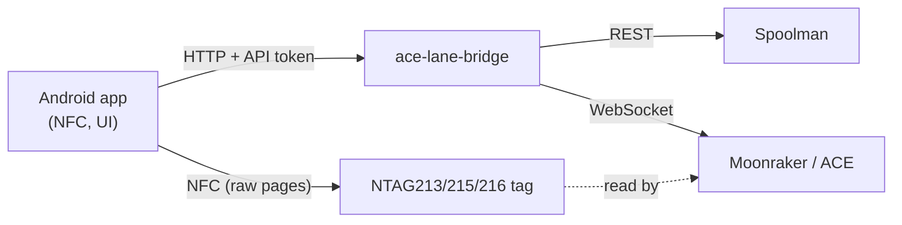

# Android app "Kobra Spoolman" — concept

[Back to README](../README.md)

Status: **concept, nothing built yet** (2026-09-30). Code will live in `android/`.

## Goal

Everything that happens at the printer, done on the phone — without a PC and without Spoolman's
web UI:

- create a new spool (and, if needed, a new filament with all its Orca settings) in under a minute,
- write an ACE-compatible NFC tag for it,
- scan any spool to see it and act on it (load into a slot, shelf, empty/archive),
- see and change the ACE slot assignment.

Spoolman stays the single source of truth; the app is a better front end for it.

## Principles

1. **Native Android** (Kotlin, Jetpack Compose, Material 3). A web page cannot do it: Web NFC only
   reads and writes NDEF messages — "low-level operations are currently not supported"
   ([MDN](https://developer.mozilla.org/en-US/docs/Web/API/Web_NFC_API)) — while the ACE reads raw
   MIFARE Ultralight pages.
2. **The app only talks to the bridge**, never to the printer or to Spoolman directly. The bridge
   stays the one client on the printer (Rinkhals hardware limits, see `CLAUDE.md` of the setup) and
   the rules (templates, inheritance, tag numbers) live in one place.
3. **Inheritance is kept.** Empty Orca fields on a filament mean "from the template / Orca base
   profile". The app shows template values as greyed hints and only writes fields the user
   actually sets — never a copy of the template.
4. **Own implementation of the tag format.** [ACE-RFID](https://github.com/DnG-Crafts/ACE-RFID) has
   no licence, so its code is not reused. The page layout is documented there and is verified
   against dumps of real Anycubic tags (unit tests).
5. **UI texts German** (like the plugin and the slot page), strings in resources so English can
   follow.

## Stages

Each stage is usable on its own.

### Stage 1 — bridge API for the app

| Method | Path | Purpose |
|---|---|---|
| GET | `/api/app/catalog` | vendors, filaments, templates, extra-field definitions (with units), known Orca base profiles |
| POST | `/api/app/vendor` | create a vendor |
| POST | `/api/app/filament` | create a filament (native + extra fields; only the fields set) |
| POST | `/api/app/filament/{id}/copy` | new colour of an existing product line: copy everything but name/colour |
| PATCH | `/api/app/filament/{id}` | change a filament (same rules as Orca back-sync) |
| POST | `/api/app/spool` | create a spool (optionally straight into a slot) |
| POST | `/api/app/tag/issue` | reserve a tag number for a spool and return the tag content to write |
| POST | `/api/app/tag/link` | link a written tag (number + UID) or an original Anycubic tag (UID only) to a spool |
| GET | `/api/app/tag/{uid}` | spool for a scanned tag |
| POST | `/api/slots/{slot}`, … | existing slot and shelf actions |

- **API token** for all writing calls (`APP_TOKEN` in the stack; entered once in the app). The
  bridge currently has no authentication; the app writes to Spoolman, so any device on the LAN
  should not be able to.
- **Orca base profiles:** the bridge does not know Orca's profile names. The Orca plugin sends the
  list of system filament profiles it resolved to the bridge (`POST /api/orca/bases`), so the app
  can offer a searchable list instead of free text.
- Tag numbers are unique per spool and stored in Spoolman (spool extra field, next to the existing
  `nfc_uid`). The number format (random vs. sequential, SKU range) depends on the open test below.

### Stage 2 — app basics

1. **Slots** — the four ACE slots as large colour cards (spool, material, remaining weight, hints
   such as *kein Material am Drucker*), tap for actions. Refreshes live.
2. **Scan** — hold a spool to the phone: spool card with remaining weight, material, temperatures,
   last prints; actions *In Slot N*, *Ins Regal*, *Leer / archivieren*, *Tag neu schreiben*.
3. **New spool from an existing filament** — search filament (vendor, name, colour swatch) →
   confirm weight → optionally *direkt in Slot N* → hold an empty tag → written and linked.
4. **Write tag** in ACE format for any spool.

### Stage 3 — new filament on the phone

A step-by-step form; every step shows what the template would give:

| Step | Fields |
|---|---|
| Vendor | pick or create |
| Product | name, material (from the template list), template (auto by material, changeable), Orca base profile (searchable list) |
| Colour | colour picker, hex input, or pick from the camera image; multi-colour optional |
| Physical | diameter, density, net weight, empty spool weight, price |
| Printing | nozzle / first layer, bed textured / smooth (+ first layer), chamber |
| Cooling | part fan min/max, fan off first layers, overhang fan, aux fan, air filtration, exhaust during/after print |
| Extrusion | flow ratio, pressure advance, max volumetric speed |
| Retraction | length, speed, Z-hop |
| Overrides | free Orca overrides (`key = value`) |
| Spool | initial weight, lot, purchase date, price, comment, location |

Values from the template are shown as placeholders; *Hersteller-Werte übernehmen* copies a known
product line (all settings of another filament of the same vendor). Also: link original Anycubic
spools by the tag's UID (read-only tags, but the UID is unique per tag — unlike `gate_spool_id`).

### Stage 4 — automation (after the tag test)

If the ACE passes a custom tag number through (`gate_spool_id`), the bridge assigns the spool to
the slot by itself — also during a print, so consumption continues on the new spool at once.

## Test environment (phone only at the end)

- **Android emulator** on the development PC (KVM available) for all UI and API work;
  screenshots via `adb` for review.
- **NFC behind an interface**: the debug build has a fake reader/writer (virtual tags in app
  storage, "scan" via a debug button), because the emulator has no NFC.
- **Tag codec as plain Kotlin** with JVM unit tests against real tag dumps (read once from an
  Anycubic tag).
- **Local test backend**: a throw-away Spoolman with test data and the bridge against a simulated
  printer (recorded `mmu` states), so development never writes to the real Spoolman or printer.
- **Real phone last**: NFC read/write with real tags, then against the real bridge.

## Build and distribution

- `android/` in this repository, Gradle, CI job builds and tests on every push.
- Signed release APK attached to the GitHub release (keystore as repository secret); installed by
  file, no Play Store. Own version (`app x.y.z` in the changelog).
- Minimum Android 10 (API 29), target the current API level.

## Open points

- Tag number format — depends on whether the ACE accepts a custom SKU (`AHPEBK-4711` →
  `gate_spool_id` 4711, see [findings](findings.md#anycubic-rfid-tags)).
- Exact page layout of the ACE tag verified against a real dump.
- Which spool fields are shown by default vs. behind *mehr*.
