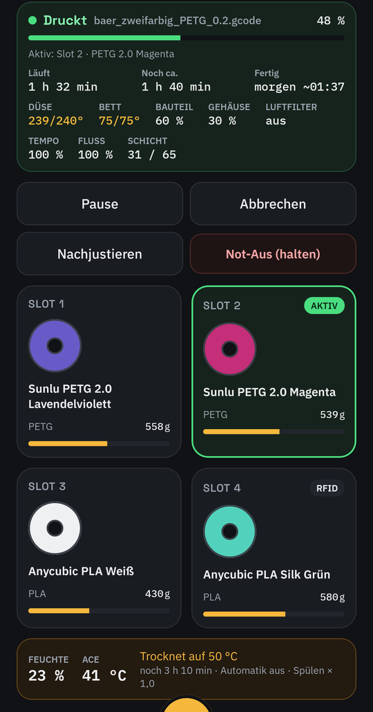
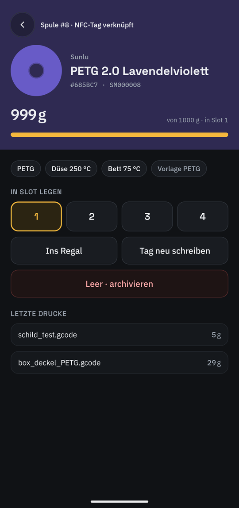
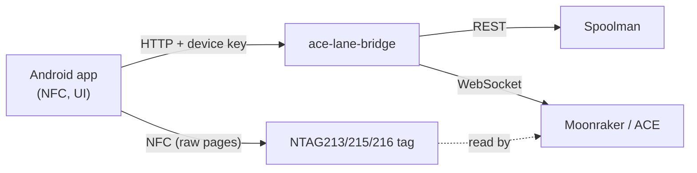

# Android app "Kobra Spoolman"

[Back to README](../README.md)

Status: **released** — signed APK on every GitHub release, updates through the bridge; in daily use
on a Galaxy S26 Ultra, NFC tags and automatic slot assignment tested on the real printer.
Code: [`android/`](../android).

<table>
  <tr>
    <td align="center"><br><sub>Start: camera, print, printer data, controls</sub></td>
    <td align="center"><br><sub>The four ACE slots and the dryer</sub></td>
    <td align="center"><br><sub>Spool card: slot, shelf, tags, archive</sub></td>
  </tr>
</table>

<p align="center"><br>
<sub>The running print as a Live Update: always on top, progress, remaining and finish time, layer</sub></p>

## What it does

Everything that happens at the printer, on the phone — the same as the [web UI](usage.md), plus NFC:

Tabs at the bottom: **Start · Meldungen · (scan) · Filament · Mehr**.

- **Start** — only what matters while printing: the camera (the model only during a print), below
  it the print (*Bereit*, *Druckt* with file, progress, running/remaining/finish time, *Pausiert*,
  *Fehler*, *Offline*) with nozzle, bed, fans, speed and flow, then the four ACE slots and the ACE
  line (humidity, dryer). Below the print: pause/resume, cancel, *Nachjustieren* (speed,
  flow, fans, temperatures) and an emergency stop you hold for two seconds; after an emergency stop or a
  Klipper error *Klipper neu laden*. During a print the model
  is the bridge's [3D view](usage.md#watching-a-print-in-3d) in a WebView (`/viewer`; rotate, layer
  slider, full screen); *Einstellungen → 3D-Modell* picks the rendering for this phone. All from the bridge's existing Moonraker subscription — the app
  adds no load on the printer.
- **Meldungen** — the same messages and status as the web UI; the tab shows a counter (red for
  errors, yellow for warnings).
- **Filament** — *Spulen* (all spools, in the ACE and on the shelf) and *Sorten* (filament types
  with their number of spools; tapping one lists its spools); *+* adds a spool or a filament type.
- **Notifications** (replaces the OctoApp companion, which took 64 % of the printer's CPU) — a
  background service asks only the bridge (every 5 s while printing, 30 s otherwise). The running print
  is a **Live Update** on Android 16+ (`ProgressStyle`, promoted ongoing: top of the shade, lock
  screen, *48 %* chip in the status bar; no picture allowed there) and a normal notification with a
  camera picture otherwise. Channels with **own sounds**: *Druck gestartet*, *Erste Schicht fertig*,
  *Druck fertig* (group *Druck*), *Alarm* (with a fresh camera picture: error, cancel or pause not sent
  through the bridge — `last_control` —, colour change > 3 min, nozzle falling, printer or bridge gone
  during a print, spool won't last) and *Hinweise* (unknown tag, slot without material, Spoolman gone
  > 5 min); *Überwachung* is the silent service notification without a print. Bridge messages are told
  apart by their key, so a changing number does not notify again. *Einstellungen → Töne* plays each
  sound and sends a test notification. The sounds are synthesised by
  [`android/tools/make_sounds.py`](../android/tools/make_sounds.py) (no third-party samples, MIT like
  the rest). It restarts after the phone reboots.
- **AI alarm** — when the bridge's [AI](vision.md) sees a failed print, the alarm carries the camera
  picture and three buttons: **Pausieren** (pauses through the bridge and labels the picture as a real
  failure), **Stimmt** (labels it as a real failure) and **Fehlalarm** (silences the AI for this print,
  labels the picture as a false alarm).
- **Mehr → KI** — state and score, *Diesen Druck nicht überwachen*, the main settings (on/off,
  sensitivity, report or pause, phone alarm level, nozzle off after pause, quiet hours), baseline and
  collection size, events with picture and verdict. Areas and the picture collection are in the web UI.
- The nozzle alarm only fires when the nozzle had reached its target and then stays more than 15 °C
  below it for 60 s, from layer 1 on — heating up and the 140 °C probing during the preparation are no
  alarm. A printer error must last 10 s (the stock firmware reported `error` for under a second while preparing).
- The app never crashes on an unexpected bridge answer; it shows "Antwort der Bridge nicht lesbar".
- **Mehr** — ACE & dryer, print history, **Protokoll** (read-only: commands sent through the bridge
  with their source, the printer's answers, and the bridge log — sending G-code stays in the web UI's
  terminal), devices, settings.
- **Spool card** — remaining weight, temperatures, template, last prints, **Feuchte** (estimate,
  where it is, last drying, *Außerhalb getrocknet …*); *In Slot 1–4*,
  *Ins Regal*, *Tags schreiben*, *Leer · archivieren*.
- **Scan** — hold a spool to the phone: known tag → spool card; an unknown **blank** sticker → write it
  for a new or an existing spool (then the second sticker); an unknown tag **with content** (e.g. an
  original Anycubic tag, write-protected) → new spool or link its UID to an existing one.
- **New spool** from an existing filament, optionally straight into a slot.
- **New filament** — a 7-step wizard with every Orca field; template values are placeholders and
  never stored; *Werte übernehmen von …* copies a product line for a new colour.
- **Write ACE tags** — the bridge reserves a tag number per spool; the app writes pages 4–31 in the
  ACE layout (verified byte for byte against original tags), reads them back and links the UID.
  The ACE 2 Pro reads only the spool side facing its reader, so the app writes **two stickers with the
  same content**, one per side (*Tag 1 von 2*, *Tag 2 von 2*); both IDs are linked, a scan of either
  finds the spool. *2. Tag schreiben* adds a missing second one.
  Tag format: [findings](findings.md#anycubic-rfid-tags).
- **ACE dryer** — humidity/temperature card; start, stop and the automation rules; the humidity
  history (6 h – 30 days, set point while drying, prints and dryings as bands) and the list of dryings
  with who started them and why.
- **Widget** — *Einstellungen → Widget auf den Startbildschirm*: camera picture, progress, remaining and
  finish time, refreshed by the monitoring service (no extra requests).
- **Pairing and devices** — scan the QR code from *Geräte → Gerät hinzufügen* (web UI or another
  phone); list and remove devices; show a QR code for the next one.

UI texts are German, like the web UI and the plugin.

## Install

1. Download `kobra-spoolman-app-<version>.apk` from the latest GitHub release and open it on the
   phone (allow installing from that source). The CI's debug APK (*Actions → CI → Artifacts*) is
   for development only — it has another package name (`….debug`) and gets no updates.
2. Start the app, allow *Nearby devices* (Android 17 treats the home network as "local network";
   without it every request hangs).
3. **Einstellungen → QR-Code scannen** and scan the code from the web UI (*Geräte → Gerät
   hinzufügen*) — or type the bridge address and the 6-digit code.

Unpaired, the app only reads; buttons that change something say so.

### Updates

The app has its own version (`android/app/version.properties`, changelog lines `## app x.y.z`).
On every tag the release workflow builds the APK signed with the release key (GitHub secrets
`ANDROID_KEYSTORE_BASE64`, `ANDROID_KEYSTORE_PASSWORD`; it refuses a debug-signed build), attaches it
to the GitHub release and puts it into the bridge's Docker image together with `app.json`.
The app asks the bridge (`GET /api/app/update`) once per start; a newer version shows up under
**Mehr** (dot on the tab). One tap downloads it from the bridge (`/api/app/update/apk`) and hands it
to Android's package installer, which asks before installing. The first time Android asks to allow
*Install unknown apps* for Kobra Spoolman. Bridge and app therefore always match, and the phone
needs no internet access.

## Principles

1. **Native Android** (Kotlin, Jetpack Compose, Material 3). A web page cannot write the tags: Web NFC
   only handles NDEF messages, the ACE reads raw MIFARE Ultralight pages.
2. **The app only talks to the bridge** (`/api/app/*`, [API](api.md#app-and-web-ui)), never to the
   printer or Spoolman directly. The bridge stays the one client on the printer and the rules
   (templates, inheritance, tag numbers) live in one place.
3. **Inheritance is kept.** Only fields the user actually sets are written — never a copy of the template.
4. **Own implementation of the tag format.** [ACE-RFID](https://github.com/DnG-Crafts/ACE-RFID) has no
   licence, so its code is not reused; the layout is verified against dumps of real tags (unit tests).



## Build

Needs JDK 17+ and the Android SDK (platform 37); see [android/README.md](../android/README.md).

```bash
cd android
./gradlew testDebugUnitTest assembleDebug
```

The debug build has **virtual tags** in the scan sheet for testing on the emulator (no NFC). CI
builds and tests the app on every push and attaches the debug APK.

## Next

- Spool swap during a print and the ACE's backup spool (*Automatisch nachladen*) still to be checked on
  a real print: consumption has to continue on the spool of the new slot.
