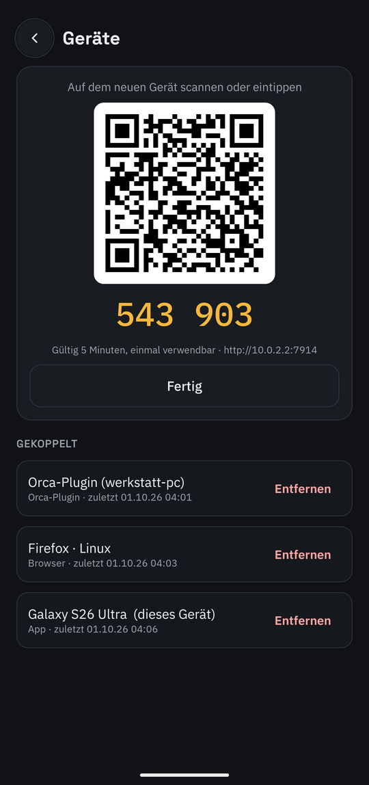
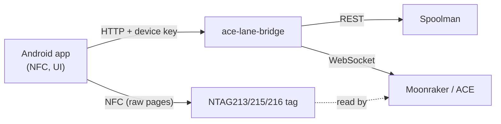

# Android app "Kobra Spoolman"

[Back to README](../README.md)

Status: **preview** — feature-complete for daily use, tested on the emulator; not yet signed or
released, real NFC stickers still to be tested on the phone. Code: [`android/`](../android).

<table>
  <tr>
    <td align="center"><br><sub>Slots, printer, dryer, shelf</sub></td>
    <td align="center"><br><sub>Spool card: slot, shelf, tag, archive</sub></td>
    <td align="center"><br><sub>Devices: QR code for the next device</sub></td>
  </tr>
</table>

## What it does

Everything that happens at the printer, on the phone — the same as the [web UI](usage.md), plus NFC:

Tabs at the bottom: **Start · Meldungen · (scan) · Filament · Mehr**.

- **Start** — only what matters while printing: the camera (the model only during a print), below
  it the print (*Bereit*, *Druckt* with file, progress, running/remaining/finish time, *Pausiert*,
  *Fehler*, *Offline*) with nozzle, bed, fans, speed and flow, then the four ACE slots and the ACE
  line (humidity, dryer, purge). All from the bridge's existing Moonraker subscription — the app
  adds no load on the printer.
- **Meldungen** — the same messages and status as the web UI; the tab shows a counter (red for
  errors, yellow for warnings).
- **Filament** — *Spulen* (all spools, in the ACE and on the shelf) and *Sorten* (filament types
  with their number of spools; tapping one lists its spools); *+* adds a spool or a filament type.
- **Mehr** — ACE & dryer, print history, **Protokoll** (read-only: commands sent through the bridge
  with their source, the printer's answers, and the bridge log — sending G-code stays in the web UI's
  terminal), devices, settings.
- **Spool card** — remaining weight, temperatures, template, last prints; *In Slot 1–4*,
  *Ins Regal*, *Tag neu schreiben*, *Leer · archivieren*.
- **Scan** — hold a spool to the phone: known tag → spool card; unknown tag → new spool or link to an
  existing one. Original Anycubic tags are linked by their UID (they are write-protected).
- **New spool** from an existing filament, optionally straight into a slot.
- **New filament** — a 7-step wizard with every Orca field; template values are placeholders and
  never stored; *Werte übernehmen von …* copies a product line for a new colour.
- **Write ACE tags** — the bridge reserves a tag number per spool; the app writes pages 4–31 in the
  ACE layout (verified byte for byte against original tags), reads them back and links the UID.
  Tag format: [findings](findings.md#anycubic-rfid-tags).
- **ACE dryer** — humidity/temperature card; start, stop and the automation rules.
- **Pairing and devices** — scan the QR code from *Geräte → Gerät hinzufügen* (web UI or another
  phone); list and remove devices; show a QR code for the next one.

UI texts are German, like the web UI and the plugin.

## Install

1. Download the debug APK from the latest CI run (*Actions → CI → Artifacts →
   kobra-spoolman-debug-apk*) and install it (`adb install -r app-debug.apk`, or open the file on the
   phone and allow installing from that source).
2. Start the app, allow *Nearby devices* (Android 17 treats the home network as "local network";
   without it every request hangs).
3. **Einstellungen → QR-Code scannen** and scan the code from the web UI (*Geräte → Gerät
   hinzufügen*) — or type the bridge address and the 6-digit code.

Unpaired, the app only reads; buttons that change something say so.

## Principles

1. **Native Android** (Kotlin, Jetpack Compose, Material 3). A web page cannot write the tags: Web NFC
   only handles NDEF messages, the ACE reads raw MIFARE Ultralight pages.
2. **The app only talks to the bridge** (`/api/app/*`, [API](api.md#app-and-web-ui)), never to the
   printer or Spoolman directly. The bridge stays the one client on the printer and the rules
   (templates, inheritance, tag numbers) live in one place.
3. **Inheritance is kept.** Only fields the user actually sets are written — never a copy of the template.
4. **Own implementation of the tag format.** [ACE-RFID](https://github.com/DnG-Crafts/ACE-RFID) has no
   licence, so its code is not reused; the layout is verified against dumps of real tags (unit tests).



## Build

Needs JDK 17+ and the Android SDK (platform 37); see [android/README.md](../android/README.md).

```bash
cd android
./gradlew testDebugUnitTest assembleDebug
```

The debug build has **virtual tags** in the scan sheet for testing on the emulator (no NFC). CI
builds and tests the app on every push and attaches the debug APK.

## Next

- Test with real NTAG215 stickers: does the ACE report our tag number (`AHPEBK-4711` →
  `gate_spool_id` 4711)? If yes, the bridge assigns a spool to its slot by itself when it is loaded —
  also during a print, so consumption continues on the new spool at once.
- Signed release APK attached to the GitHub release (keystore as repository secret), own version in
  the changelog.
