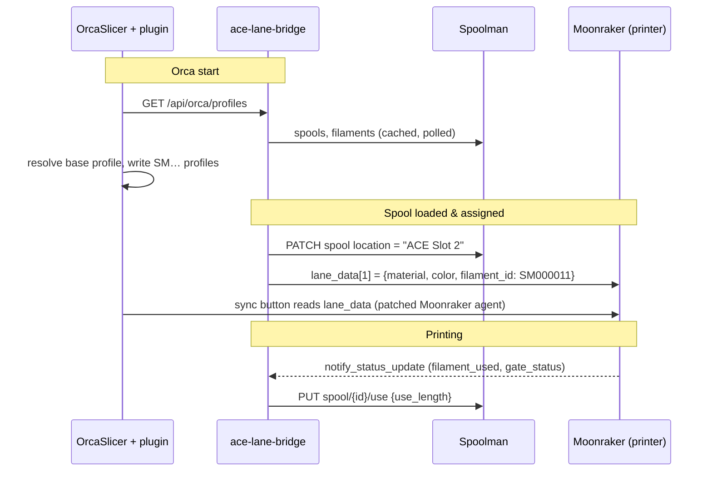

# Architecture

[Back to README](../README.md)

## Principles

1. **Spoolman is the single source of truth** for everything about filament: properties, Orca
   settings, remaining weight and where a spool is (`ACE Slot N` or the shelf).
2. **No firmware patches.** The bridge only talks to Moonraker (Rinkhals) and Spoolman over their
   public APIs. The ACE keeps working on its own (runout backup, RFID).
3. **Measure, don't estimate.** Consumption comes from the printer's extrusion counter.
4. **Nothing is lost silently.** Unbookable consumption becomes an open item; the bridge survives
   restarts mid-print.

## Components and data flow

## Consumption algorithm (`bridge/app/acebridge/usage.py`)

Based on a real test print (see [findings.md](findings.md)):

- `print_stats.filament_used` counts every extruder move **including the firmware's own purge**
  and matches Orca's model length to the millimetre.
- Consumption = **signed** delta of `filament_used`; retracts cancel out.
- Each delta belongs to the **last active slot** (`mmu.gate_status == -1`). Moments without an
  active slot (unloading, ACE flicker) do not change that.
- A new slot is confirmed after `GATE_DEBOUNCE_S`; consumption during that window goes to whichever
  slot wins. Consumption before the first active slot goes to the first one.
- Purge at a colour change therefore lands on the **newly loaded** filament — which is physically right.
- Buckets are *(slot, spool)*: if the spool in a slot changes mid-print, both get their share.
- Bookings: `PUT /api/v1/spool/{id}/use` with `use_length` (Spoolman converts using density and
  diameter). At every slot change, every `BOOK_INTERVAL_S` and at the end.
- State (`data/usage/state.json`) is written atomically right after every successful booking, so a
  crash cannot book twice; on restart the bridge continues from the saved counter.
- Target comparison: the firmware reports the G-code header per filament in
  `virtual_sdcard.filament_used` (labelled "m", actually cm³) — used for warnings and the
  purge statistics.

## Orca profiles

- The bridge computes, per filament with an active spool, the values that come from Spoolman
  (filament → template → overrides) — `GET /api/orca/profiles`.
- The plugin resolves the **Orca base profile** from Orca's own system profile JSONs
  (`<data dir>/system`, `$APPDIR/resources/profiles`, or wherever Orca says the preset lives),
  merges the inheritance chain, applies the Spoolman values and writes a **user base profile**
  (`inherits: ""`, `filament_id: SM…`) to `user/<folder>/filament/base/`. Only base profiles keep a
  custom `filament_id`; inherited user presets would take the parent's ID.
- Profiles written by the plugin carry a marker in `filament_notes`; only those are ever updated or deleted.
- Orca reads profiles at start-up only → new or changed profiles need a restart.
- Back-sync: on Orca's `PresetSaved` event the plugin diffs the saved file against what it wrote,
  asks, and posts the changes to `/api/orca/backsync`.

## Why no custom printer agent?

The first proof of concept was a Python printer agent that reported the slots itself. It proved
that Orca picks custom profiles by `filament_id`, but printing through a Python agent is not
practical today: Orca's plugin sandbox has no file access to the temporary print file, so every
print would trigger a permission prompt (on a worker thread). Instead, the built-in Moonraker agent
does the printing, and a 70-line patch ([PR #14423](https://github.com/OrcaSlicer/OrcaSlicer/pull/14423))
makes it match presets by `lane_data.filament_id` — which the bridge already writes.

## Usage preview after slicing

On `SlicingJobComplete` (and on every panel refresh) the plugin reads
`orca.host.slice_statistics()` — per filament the model, support, prime tower, flush and total
volume plus density, the same numbers as Orca's preview legend. `build_forecast()` converts them
to grams, adds the firmware purge per load (`usage.purge` from the bridge: the average of
`(measured − G-code target) / loads` over finished prints) and compares the sum with the spool's
remaining weight. Filament N is counted against slot N. When the plate's slice result becomes
invalid the preview is hidden. Without patch 0003 the attribute is missing and the preview is
simply not shown (feature detection, no version check).

## Threads in the plugin

Network and file work run in one background thread; Orca preset objects are only touched on the UI
thread (panel messages, events). Dialogs and dock panels are thread-safe in Orca's plugin API.
