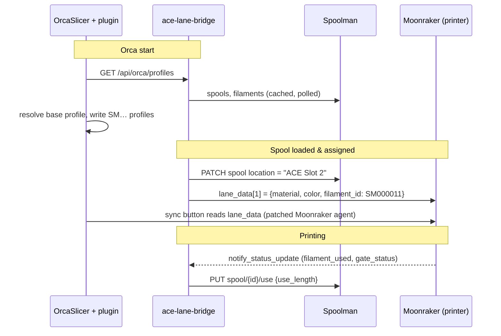

# Architecture

[Back to README](../README.md)

## Principles

1. **Spoolman is the single source of truth** for everything about filament: properties, Orca
   settings, remaining weight and where a spool is (`ACE Slot N` or the shelf).
2. **No firmware patches.** The bridge only talks to Moonraker (Rinkhals) and Spoolman over their
   public APIs. The ACE keeps working on its own (runout backup, RFID).
3. **Measure, don't estimate.** Consumption comes from the printer's extrusion counter.
4. **Nothing is lost silently.** Unbookable consumption becomes an open item; the bridge survives
   restarts mid-print.

## Components and data flow

```mermaid
sequenceDiagram
    participant O as OrcaSlicer + plugin
    participant B as ace-lane-bridge
    participant S as Spoolman
    participant M as Moonraker (printer)

    Note over O,B: Orca start
    O->>B: GET /api/orca/profiles
    B->>S: spools, filaments (cached, polled)
    O->>O: resolve base profile, write SM… profiles
    Note over B,M: Spool loaded & assigned
    B->>S: PATCH spool location = "ACE Slot 2"
    B->>M: lane_data[1] = {material, color, filament_id: SM000011}
    O->>M: sync button reads lane_data (patched Moonraker agent)
    Note over B,M: Printing
    M-->>B: notify_status_update (filament_used, gate_status)
    B->>S: PUT spool/{id}/use {use_length}
```

## Clients and pairing (`bridge/app/acebridge/auth.py`)

The bridge is the only component of this project that talks to the printer — the Kobra S1 handles
only a few Moonraker clients. Browser, Android app and Orca plugin are clients of the bridge.

- **Reading is open**, like Moonraker and Spoolman in a home network.
- **Writing needs a paired device:** Spoolman changes, slot assignment, open items, the dryer and
  Orca back-sync. The client sends `Authorization: Bearer <key>`.
- The **bridge issues the keys** (`secrets.token_urlsafe(32)`), one per device, and stores only
  their SHA-256 in `devices.json`. A device is paired with a 6-digit code (5 minutes, single use)
  that a paired device requests; the very first device uses a setup code that the bridge logs at
  start while nothing is paired. Wrong codes are throttled. The app pairs by scanning a QR code
  (`kobraspoolman://pair?b=<bridge-url>&c=<code>`).
- Removing a device revokes its key immediately; a client that gets 401 drops its key and asks to
  pair again. A legacy `APP_TOKEN` keeps working as a key and pairing code during the transition.
- **Camera key:** camera images are private too (paired devices only), but Mainsail and an ``
  tag cannot send a header. A separate, view-only key (`camera.json`) is accepted as `?key=` on the
  camera URLs; any paired device can show or replace it.

## Messages and status (`bridge/app/acebridge/status.py`)

Computed on every `/api/app/state` from what the bridge already holds — no extra request to the
printer. The print file parsed for the preview (`render.py`) also records the net extrusion per tool
(retractions cancel out) with a checkpoint every 256 KB and at every tool change, plus the list of
tool changes. From the current `file_position` the bridge gets what each tool still prints and which
changes are still to come; the purge model adds the purge of those changes. Mapped to slots via
`mmu.ttg_map` and compared with the assigned spool's remaining weight, this gives "spool won't last".

## Camera restream (`bridge/app/acebridge/camera.py`)

On the Kobra S1 a single MJPEG stream from Rinkhals' mjpg-streamer takes the whole CPU, while single
snapshots up to ~5 per second cost nothing measurable ([findings](findings.md#camera-load-on-the-kobra-s1-2026-10-01)).
The bridge therefore fetches snapshots one after another — only while someone watches, closed 20 s
after the last viewer — and fans each frame out: web UI, app, Mainsail (camera link) and later the AI
service. Each viewer always gets the newest frame; a slow viewer skips frames instead of queueing.
The rate follows the printer's CPU from Moonraker's `notify_proc_stat_update` (pushed anyway, no extra
request, mean over 10 s): +1 fps every 5 s below 90 %, −1 fps every 5 s above 97 % (1–10 fps by
default). The thresholds are high on purpose: during a print GoKlipper alone keeps the S1 at 75–89 %,
and snapshots cost next to nothing, so the camera should only give way when the printer is saturated. The UIs show the frame rate in the corner and *gedrosselt* when the bridge holds back;
*Status* shows the printer CPU.

## Web UI (`bridge/app/acebridge/static/`)

- Served by the bridge itself at `/`; no build step: [Preact](https://preactjs.com/) with
  [htm](https://github.com/developit/htm) tagged templates as ES modules, fonts as WOFF2 and a QR
  encoder are bundled — the page works without internet.
- It uses the same API as the app (`/api/app/*`, `/api/slots`, `/api/dryer`, `/api/jobs`,
  `/api/auth/*`) and polls `/api/app/state` every 3 s (only the bridge, never the printer).
- One code base for all widths: phone (bottom bar), desktop (side bar, list + detail), ultrawide
  ≥ 3000 px (five columns on the overview). Design tokens match the Android app's theme.
- The key lives in `localStorage` of the browser.
- **No stale UI after an update** (`assets.py`): at start the bridge fingerprints all files in
  `static/`. The start page is never cached and loads everything from `assets/<fingerprint>/…`,
  which is cached for a year — new files mean new addresses. `/api/app/state` reports the
  fingerprint as `ui`; an open page with an older one reloads itself (not while a dialog or an editor
  is open or you are typing).

## Consumption algorithm (`bridge/app/acebridge/usage.py`)

Based on a real test print (see [findings.md](findings.md)):

- `print_stats.filament_used` counts every extruder move **including the firmware's own purge**
  and matches Orca's model length to the millimetre.
- Consumption = **signed** delta of `filament_used`; retracts cancel out.
- Each delta belongs to the **last active slot** (`mmu.gate_status == -1`). Moments without an
  active slot (unloading, ACE flicker) do not change that.
- A new slot is confirmed after `GATE_DEBOUNCE_S`; consumption during that window goes to whichever
  slot wins. Consumption before the first active slot goes to the first one.
- Purge at a colour change therefore lands on the **newly loaded** filament — which is physically right.
- Buckets are *(slot, spool)*: if the spool in a slot changes mid-print, both get their share.
- Bookings: `PUT /api/v1/spool/{id}/use` with `use_length` (Spoolman converts using density and
  diameter). At every slot change, every `BOOK_INTERVAL_S` and at the end.
- State (`data/usage/state.json`) is written atomically right after every successful booking, so a
  crash cannot book twice; on restart the bridge continues from the saved counter.
- Target comparison: the firmware reports the G-code header per filament in
  `virtual_sdcard.filament_used` (labelled "m", actually cm³) — used for warnings and the
  purge statistics.

## Orca profiles

- The bridge computes, per filament with an active spool, the values that come from Spoolman
  (filament → template → overrides) — `GET /api/orca/profiles`.
- The plugin resolves the **Orca base profile** from Orca's own system profile JSONs
  (`<data dir>/system`, `$APPDIR/resources/profiles`, or wherever Orca says the preset lives),
  merges the inheritance chain, applies the Spoolman values and writes a **user base profile**
  (`inherits: ""`, `filament_id: SM…`) to `user/<folder>/filament/base/`. Only base profiles keep a
  custom `filament_id`; inherited user presets would take the parent's ID.
- Profiles written by the plugin carry a marker in `filament_notes`; only those are ever updated or deleted.
- Orca reads profiles at start-up only → new or changed profiles need a restart.
- Back-sync: on Orca's `PresetSaved` event the plugin diffs the saved file against what it wrote,
  asks, and posts the changes to `/api/orca/backsync`.

## Why no custom printer agent?

The first proof of concept was a Python printer agent that reported the slots itself. It proved
that Orca picks custom profiles by `filament_id`, but printing through a Python agent is not
practical today: Orca's plugin sandbox has no file access to the temporary print file, so every
print would trigger a permission prompt (on a worker thread). Instead, the built-in Moonraker agent
does the printing, and a 70-line patch ([PR #14423](https://github.com/OrcaSlicer/OrcaSlicer/pull/14423))
makes it match presets by `lane_data.filament_id` — which the bridge already writes.

## Usage preview after slicing

On `SlicingJobComplete` (and on every panel refresh) the plugin reads
`orca.host.slice_statistics()` — per filament the model, support, prime tower, flush and total
volume plus density, the number of loads and the filament changes (`transitions`: from → to with
counts). `build_forecast()` converts them to grams exactly like Orca's preview legend (*Gesamt* =
model + support + flush + tower; Orca's own `total_volumes_per_extruder` attributes the tower
differently at tool changes and is not used), adds the firmware purge and compares the sum with the
spool's remaining weight. Filament N is counted against slot N.

**Firmware purge per colour change** (`bridge/app/acebridge/purge.py`, the same formula in the
plugin): for prints via Moonraker the firmware ignores the slicer's flush matrix and computes
`clamp(orca_colour_volume(from, to) + flush_volume_min, min, max) × flush_multiplier` — Orca's own
`FlushVolCalculator` on the colours the ACE reports, see [findings](findings.md#the-firmwares-own-flush-setting).
The bridge reads `flush_multiplier`, `flush_volume_min` and `flush_volume_max` from GoKlipper
(`/printer/filament_hub/get_config`, every 10 minutes) and records every load of a print with its
colours. From finished Orca prints (where *measured − G-code target* is the purge alone) it fits two
small constants by least squares: an offset per change (≈ −3 mm) and the first load of a print
(≈ 95 mm). `usage.purge.model` in `/api/orca/state` carries all of it. Fallbacks: an Orca build
without `transitions` averages the changes from the other used colours; a bridge without the model
gives the old measured average per load. When the plate's slice result becomes
invalid the preview is hidden. Without patch 0003 the attribute is missing and the preview is
simply not shown (feature detection, no version check).

## Threads in the plugin

Network and file work run in one background thread; Orca preset objects are only touched on the UI
thread (panel messages, events). Dialogs and dock panels are thread-safe in Orca's plugin API.
