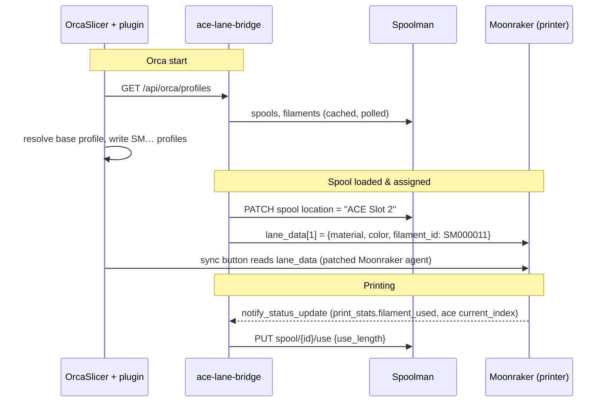

# Architecture

[Back to README](../README.md)

## Principles

1. **Spoolman is the single source of truth** for everything about filament: properties, Orca
   settings, remaining weight and where a spool is (`ACE Slot N` or the shelf).
2. **No firmware patches.** The bridge only talks to Moonraker (Klipper on a Raspberry Pi with the
   ACEPRO driver) and Spoolman over their public APIs. The ACE keeps working on its own (endless spool,
   RFID). Bridge 2.x did the same against the stock firmware with Rinkhals.
3. **Measure, don't estimate.** Consumption comes from the printer's extrusion counter.
4. **Nothing is lost silently.** Unbookable consumption becomes an open item; the bridge survives
   restarts mid-print.

## Components and data flow

```mermaid
sequenceDiagram
    participant O as OrcaSlicer + plugin
    participant B as ace-lane-bridge
    participant S as Spoolman
    participant M as Moonraker (printer)

    Note over O,B: Orca start
    O->>B: GET /api/orca/profiles
    B->>S: spools, filaments (cached, polled)
    O->>O: resolve base profile, write SM… profiles
    Note over B,M: Spool loaded & assigned
    B->>S: PATCH spool location = "ACE Slot 2"
    B->>M: lane_data[1] = {material, color, filament_id: SM000011}
    O->>M: sync button reads lane_data (patched Moonraker agent)
    Note over B,M: Printing
    M-->>B: notify_status_update (print_stats.filament_used, ace current_index)
    B->>S: PUT spool/{id}/use {use_length}
```

## Clients and pairing (`bridge/app/acebridge/auth.py`)

The bridge is the only component of this project that talks to the printer — the Kobra S1 handles
only a few Moonraker clients. Browser, Android app and Orca plugin are clients of the bridge.

- **Reading is open**, like Moonraker and Spoolman in a home network.
- **Writing needs a paired device:** Spoolman changes, slot assignment, open items, the dryer and
  Orca back-sync. The client sends `Authorization: Bearer <key>`.
- The **bridge issues the keys** (`secrets.token_urlsafe(32)`), one per device, and stores only
  their SHA-256 in `devices.json`. A device is paired with a 6-digit code (5 minutes, single use)
  that a paired device requests; the very first device uses a setup code that the bridge logs at
  start while nothing is paired. Wrong codes are throttled. The app pairs by scanning a QR code
  (`kobraspoolman://pair?b=<bridge-url>&c=<code>`).
- Removing a device revokes its key immediately; a client that gets 401 drops its key and asks to
  pair again. A legacy `APP_TOKEN` keeps working as a key and pairing code during the transition.
- **Camera key:** camera images are private too (paired devices only), but Mainsail and an ``
  tag cannot send a header. A separate, view-only key (`camera.json`) is accepted as `?key=` on the
  camera URLs; any paired device can show or replace it.

## Messages and status (`bridge/app/acebridge/status.py`)

Computed on every `/api/app/state` from what the bridge already holds — no extra request to the
printer. The print file parsed for the preview (`render.py`) also records the net extrusion per tool
(retractions cancel out) with a checkpoint every 256 KB and at every tool change, plus the list of
tool changes. From the current `file_position` the bridge gets what each tool still prints and which
changes are still to come; each change adds the load to the nozzle (85 mm) and the purge the file sets
before it (`ACE_SET_PURGE_AMOUNT PURGELENGTH=`, from Orca's flushing volumes; 50 mm without). Tool T*n* is
slot *n*+1; compared with the assigned spool's remaining weight, this gives "spool won't last". The same
parse gives the per-slot G-code targets for the check at the end of a print.

## Camera restream (`bridge/app/acebridge/camera.py`)

The camera still runs on the printer (its own mjpg-streamer); its address comes from Moonraker's webcam
list. Under the stock firmware a single MJPEG stream took the whole printer CPU, while single snapshots up
to ~5 per second cost nothing measurable ([findings](findings.md#camera-load-on-the-kobra-s1-2026-10-01)).
The bridge therefore fetches snapshots one after another by default (`CAMERA_STREAM=false`) — only while
someone watches, closed 20 s after the last viewer — and fans each frame out: web UI, app, Mainsail
(camera link) and the AI service. Each viewer always gets the newest frame; a slow viewer skips frames
instead of queueing. With Klipper on the Pi the printer has plenty of headroom, so the rate is simply
`CAMERA_FPS_MAX` (the CPU-based throttling of bridge 2.x is gone). *Status* shows the CPU of the Klipper
host (the Pi).

## AI print-failure detection (`vision.py`, `vision/`)

A separate container (kobra-vision, AGPL-3.0, Obico's failure model on ONNX Runtime) does the image
recognition; the bridge sends it one picture every 10 s while printing (newest restream frame or one
single snapshot — it never starts the camera pump for this), judges the result over time like Obico
(EWM against a baseline, safe start, warn/fail thresholds), raises messages, stores frames and labels.
Details: [vision.md](vision.md).

## Klipper modules on the printer (`pa.py`, `filament_z.py`, `resume.py`, `clog.py`)

Since 3.0 the printer runs real Klipper, so features that need the printer's timing live in Klipper modules
(kept in a separate, private repo, not part of this one). The bridge is their link to Spoolman and to the
UIs: it subscribes to their status objects (optional — a missing module only hides its card), turns them
into messages and cards, and switches them through G-code commands. Every module stores its own on/off
switch in the printer (`save_variables`), so it also works without the bridge.

| Bridge | Klipper object | Direction |
|---|---|---|
| `pa.py` | `kobra_pa` | Spoolman `pa_table` → `KOBRA_PA_SET` per slot; measured result → back to the filament (`pa_table`, `pressure_advance`) |
| `filament_z.py` | `KOBRA_START` variable `slot_z` | Spoolman `z_offset` (or the template's) of each loaded slot → printer; the print start applies the start filament's value |
| `resume.py` | `kobra_resume` | interrupted print → alarm + card; *Fortsetzen* sends `KOBRA_RESUME CONFIRM=1` only after confirmation |
| `switches.py` | all of them | one list of the modules' switches for display, web and app (`/api/switches`); sends only listed commands |
| `machine.py` | toolhead, T0–T3, ACEPRO | display control: home, jog, extrude, load/unload, fixed macros — fixed commands with limits, locked while printing |
| `clog.py` | `kobra_clog` | `suspect` → alarm until the filament moves normally again; switch and reaction (`warn`/`pause`) |

Writes to the printer wait until Spoolman is loaded (`sm.connected`), so a fresh start never sends empty slots.

## Web UI (`bridge/app/acebridge/static/`)

- Served by the bridge itself at `/`; no build step: [Preact](https://preactjs.com/) with
  [htm](https://github.com/developit/htm) tagged templates as ES modules, fonts as WOFF2 and a QR
  encoder are bundled — the page works without internet.
- It uses the same API as the app (`/api/app/*`, `/api/slots`, `/api/dryer`, `/api/jobs`,
  `/api/auth/*`) and polls `/api/app/state` every 3 s (only the bridge, never the printer).
- One code base for all widths: phone (bottom bar), desktop (side bar, list + detail), ultrawide
  ≥ 3000 px (five columns on the overview). Design tokens match the Android app's theme.
- The key lives in `localStorage` of the browser.
- **No stale UI after an update** (`assets.py`): at start the bridge fingerprints all files in
  `static/`. The start page is never cached and loads everything from `assets/<fingerprint>/…`,
  which is cached for a year — new files mean new addresses. `/api/app/state` reports the
  fingerprint as `ui`; an open page with an older one reloads itself (not while a dialog or an editor
  is open or you are typing).

## Consumption algorithm (`bridge/app/acebridge/usage.py`)

- `print_stats.filament_used` counts every extruder move — the print, and ACEPRO's load to the nozzle
  and purge at a tool change (ACEPRO patch: `gcode_move.reset_last_position()` after its direct
  extruder moves, so they show up at once).
- Consumption = **signed** delta of `filament_used`; retracts cancel out.
- Each delta belongs to the slot ACEPRO reports as loaded (`ace.current_index`); during a tool change
  after the unload (`current_index = -1`) to the incoming slot (`ace.target_index`). So the unload
  retract goes to the old filament, load and purge to the **newly loaded** one — which is physically right.
  Consumption before the first loaded slot goes to the first one.
- Buckets are *(slot, spool)*: if the spool in a slot changes mid-print, both get their share; with
  endless spool the consumption simply follows the new slot.
- Bookings: `PUT /api/v1/spool/{id}/use` with `use_length` (Spoolman converts using density and
  diameter). At every slot change, every `BOOK_INTERVAL_S` and at the end.
- State (`data/usage/state.json`) is written atomically right after every successful booking, so a
  crash cannot book twice; on restart the bridge continues from the saved counter.
- Target comparison: once the bridge has parsed the print file (`render.py`) it stores the extrusion per
  tool as the job's targets; at the end a slot that measured clearly less than its target is reported.

## Orca profiles

- The bridge computes, per filament with an active spool, the values that come from Spoolman
  (filament → template → overrides) — `GET /api/orca/profiles`.
- The plugin resolves the **Orca base profile** from Orca's own system profile JSONs
  (`<data dir>/system`, `$APPDIR/resources/profiles`, or wherever Orca says the preset lives),
  merges the inheritance chain, applies the Spoolman values and writes a **user base profile**
  (`inherits: ""`, `filament_id: SM…`) to `user/<folder>/filament/base/`. Only base profiles keep a
  custom `filament_id`; inherited user presets would take the parent's ID.
- Profiles written by the plugin carry a marker in `filament_notes`; only those are ever updated or deleted.
- Orca reads profiles at start-up only → new or changed profiles need a restart.
- Back-sync: on Orca's `PresetSaved` event the plugin diffs the saved file against what it wrote,
  asks, and posts the changes to `/api/orca/backsync`.

## Why no custom printer agent?

The first proof of concept was a Python printer agent that reported the slots itself. It proved
that Orca picks custom profiles by `filament_id`, but printing through a Python agent is not
practical today: Orca's plugin sandbox has no file access to the temporary print file, so every
print would trigger a permission prompt (on a worker thread). Instead, the built-in Moonraker agent
does the printing, and a 70-line patch ([PR #14423](https://github.com/OrcaSlicer/OrcaSlicer/pull/14423))
makes it match presets by `lane_data.filament_id` — which the bridge already writes.

## Usage preview after slicing

On `SlicingJobComplete` (and on every panel refresh) the plugin reads
`orca.host.slice_statistics()` — per filament the model, support, prime tower, flush and total
volume plus density, the number of loads and the filament changes (`transitions`: from → to with
counts). `build_forecast()` converts them to grams exactly like Orca's preview legend (*Gesamt* =
model + support + flush + tower; Orca's own `total_volumes_per_extruder` attributes the tower
differently at tool changes and is not used) and compares that with the spool's remaining weight.
Filament N is counted against slot N.

**ACE purge per colour change:** the printer profile's change-filament G-code sets the purge from Orca's
flushing volumes (`ACE_SET_PURGE_AMOUNT`) and reports load + purge to Orca with `; EXTERNAL_PURGE <mm>`
after the `T` line, so Orca counts it as *Flushed* on the new filament — Orca's legend and the preview
show the real consumption without a model of their own. If a print changes colour but reports no purge
at all, the panel says the printer profile is outdated. When the plate's slice result becomes invalid
the preview is hidden. Without patch 0003 the attribute is missing and the preview is simply not shown
(feature detection, no version check).

## Threads in the plugin

Network and file work run in one background thread; Orca preset objects are only touched on the UI
thread (panel messages, events). Dialogs and dock panels are thread-safe in Orca's plugin API.
