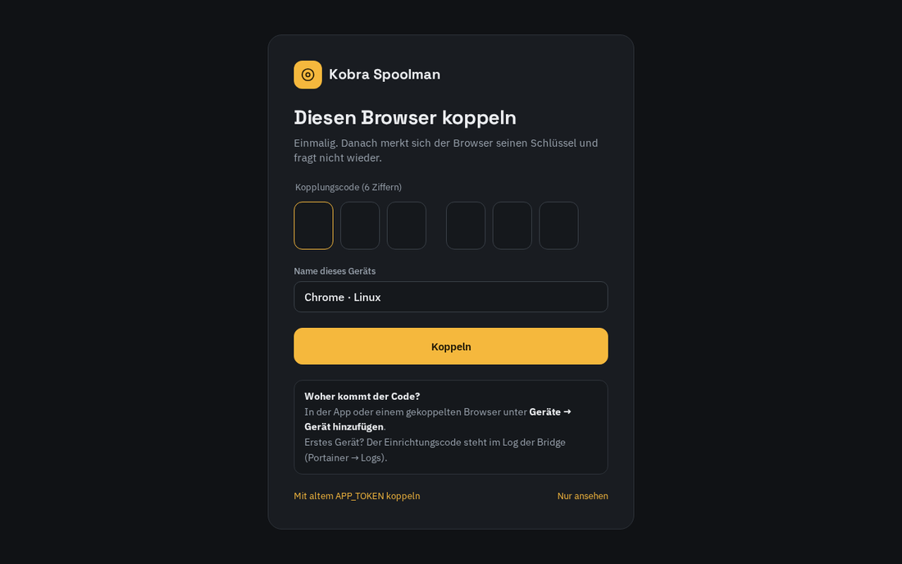

# Installation

[English](../installation.md) · [Zurück zur README](../../README.de.md)

Diese Anleitung führt von null bis zum fertigen Ablauf. Rechne mit etwa einer Stunde – das meiste
davon ist der erste OrcaSlicer-Build, den GitHub für dich erledigt.

**Überblick**

1. [Drucker: Rinkhals und Moonraker](#1-drucker-rinkhals-und-moonraker)
2. [Spoolman und seine Zusatzfelder](#2-spoolman-und-seine-zusatzfelder)
3. [ace-lane-bridge](#3-ace-lane-bridge)
4. [Das erste Gerät koppeln](#4-das-erste-gerät-koppeln)
5. [OrcaSlicer (orca-kobra-Build)](#5-orcaslicer-orca-kobra-build)
6. [Orca-Plugin „Kobra Spoolman“](#6-orca-plugin-kobra-spoolman)
7. [Android-App (optional)](#7-android-app-optional)
8. [Prüfen, ob alles läuft](#8-prüfen-ob-alles-läuft)

---

## 1. Drucker: Rinkhals und Moonraker

- [Rinkhals](https://github.com/rinkhals-community/Rinkhals) auf dem Kobra S1 installieren. Moonraker muss unter
  `http://<drucker-ip>:7125` erreichbar sein (im Browser `http://<drucker-ip>:7125/server/info` testen).
- **Moonrakers eigene Spoolman-Anbindung bleibt aus** (kein Abschnitt `[spoolman]` in
  `moonraker.conf`), sonst wird doppelt gebucht. Die Bridge warnt, falls sie an ist.
- Dem Drucker eine feste IP geben (DHCP-Reservierung) – alles andere zeigt darauf.

## 2. Spoolman und seine Zusatzfelder

Spoolman ab 0.26. Läuft es noch nicht, kommt es am besten in denselben Stack wie die Bridge
(siehe [bridge/compose.yaml](../../bridge/compose.yaml)).

Dann einmalig die Zusatzfelder und Materialvorlagen anlegen:

```bash
python3 spoolman/spoolman_setup.py --url http://<spoolman-host>:7912 --dry-run   # Plan anzeigen
python3 spoolman/spoolman_setup.py --url http://<spoolman-host>:7912             # anlegen
```

Das Skript legt nur **neu** an, ändert oder löscht nie vorhandene Felder oder Filamente – mehrfaches
Ausführen schadet nicht. Es legt an:

- **Filament-Felder** für alle Orca-Einstellungen, die man üblicherweise anpasst: erste Schicht,
  glatte PEI, Kammer, Bauteillüfter min/max, Lüfter aus in den ersten Schichten, Überhang-Lüfter,
  Hilfslüfter, Luftfilterung und Abluft, Flow Ratio, Pressure Advance, max. Volumenstrom,
  Retraction, Z-Hop, ein freies Feld *Orca-Overrides*, dazu *Orca-Basisprofil* und *Vorlage*.
  Vollständige Liste: [spoolman-fields.md](../spoolman-fields.md).
- **Spulen-Felder** *NFC-Kennung* und *Tag-Nummer* (NFC-Tags aus der App).
- Filament-Feld *Trocknen max.* – höchste Trockentemperatur, die das Filament verträgt (ACE-Trockner).
- Einen Hersteller **„Vorlage“** mit sieben Vorlagen (PLA, PLA Silk, PETG, ASA, TPU, PLA-CF, PETG-CF),
  vorbelegt aus Orcas Generic-Profilen.

## 3. ace-lane-bridge

### Variante A – Docker-Image (empfohlen)

Den Dienst in deinen Stack aufnehmen (Portainer → Stacks, oder `docker compose`):

```yaml
  ace-lane-bridge:
    image: ghcr.io/xnovosx/ace-lane-bridge:latest
    container_name: ace-lane-bridge
    restart: unless-stopped
    ports:
      - "7913:7913"
    volumes:
      - ./bridge-data:/data          # z.B. /docker/ace-lane-bridge/data
    environment:
      MOONRAKER_URL: "http://<drucker-ip>:7125"
      SPOOLMAN_URL: "http://spoolman:8000"   # Servicename im selben Stack
      TZ: Europe/Berlin
    depends_on:
      - spoolman
```

Das Image läuft als Benutzer 1000. Gehört der Datenordner root (bei Portainer und Pfaden unter
`/docker/...` üblich), entweder den Ordner für 1000 beschreibbar machen oder den Container mit
`user: "0:0"` im Dienst als root laufen lassen.

### Variante B – direkt aus dem Quellcode

Praktisch beim Entwickeln. `bridge/app/` auf den Docker-Host kopieren (z.B. nach
`/docker/ace-lane-bridge/app`) und so einbinden:

```yaml
  ace-lane-bridge:
    image: python:3.12-slim
    container_name: ace-lane-bridge
    restart: unless-stopped
    entrypoint: ["sh", "/app/entrypoint.sh"]
    ports:
      - "7913:7913"
    volumes:
      - /docker/ace-lane-bridge/app:/app:ro
      - /docker/ace-lane-bridge/data:/data
    environment:
      MOONRAKER_URL: "http://<drucker-ip>:7125"
      SPOOLMAN_URL: "http://spoolman:8000"
      TZ: Europe/Berlin
```

Beim ersten Start legt das Entrypoint-Skript eine Python-Umgebung in `data/venv` an (braucht einmal
Internet). Aktualisieren = neuen `app/`-Ordner kopieren und den Container neu starten.

### Prüfen

- `http://<docker-host>:7913` öffnet die **Weboberfläche** – zuerst mit dem Koppeln (nächster Schritt).
- `http://<docker-host>:7913/api/health` liefert Version und beide Verbindungen.
- Alle Einstellungen: [configuration.md](../configuration.md).

## 4. Das erste Gerät koppeln

Lesen darf jeder im Heimnetz; alles, was etwas ändert, braucht ein **gekoppeltes Gerät**. Die
Schlüssel vergibt die Bridge selbst – du denkst dir kein Passwort aus.

1. Das Log der Bridge öffnen (Portainer → Container → *ace-lane-bridge* → Logs, oder
   `docker logs ace-lane-bridge`). Solange nichts gekoppelt ist, steht dort
   `Noch kein Gerät gekoppelt. Einrichtungscode: 123456`.
2. `http://<docker-host>:7913` öffnen, die sechs Ziffern und einen Namen für den Browser eingeben →
   **Koppeln**. Der Browser merkt sich seinen Schlüssel und fragt nie wieder.
3. Jedes weitere Gerät (anderer Browser, Handy, Orca-Plugin) bekommt einen frischen Code von einem
   gekoppelten: Weboberfläche → **Geräte → Gerät hinzufügen** zeigt einen 6-stelligen Code und einen
   QR-Code (5 Minuten gültig, einmal verwendbar). Dort lassen sich Geräte jederzeit entfernen.

> [!NOTE]
> Kommst du von einer Version mit `APP_TOKEN`? Der alte Wert gilt weiter als Schlüssel und lässt sich
> als Kopplungscode eingeben (*Mit altem APP_TOKEN koppeln*). Sind alle Geräte gekoppelt, kann er aus dem Stack raus.

<p align="center"></p>

## 5. OrcaSlicer (orca-kobra-Build)

Das Plugin braucht Orcas Plugin-System (Nightly 2.5.0-dev). Die **automatische Profilwahl** braucht
zusätzlich einen kleinen Patch, der noch nicht in Orca übernommen ist
([PR #14423](https://github.com/OrcaSlicer/OrcaSlicer/pull/14423)). Das Repo
[orca-kobra](https://github.com/xNoVoSx/orca-kobra) baut damit jede Nacht ein Linux-AppImage und
bringt einen Starter mit, der sich selbst aktualisiert:

```bash
git clone https://github.com/xNoVoSx/orca-kobra && cd orca-kobra
tools/install.sh        # lädt das neueste AppImage, legt „OrcaSlicer (Kobra)“ im Menü an
```

Es nutzt den normalen Orca-Datenordner (`~/.config/OrcaSlicer`), deine Drucker und Profile bleiben.
Eigener Build gewünscht? orca-kobra forken – der Workflow baut ihn für dich.
Updates, Rückfall und Entfernen: [Installationsanleitung von orca-kobra](https://github.com/xNoVoSx/orca-kobra/blob/main/docs/de/installation.md).

In Orca:

- Den Drucker wie gewohnt anlegen (Anycubic Kobra S1 0.4 nozzle) und mit `http://<drucker-ip>` verbinden.
- **Druckereinstellungen → Grundlegende Informationen → Erweitert** (Expertenmodus):
  **Printer Agent = Moonraker**.

> [!TIP]
> Ohne den orca-kobra-Build funktioniert alles andere trotzdem (Profile, Panel, Rücksync,
> Verbrauch) – die `SM…`-Profile wählst du dann in den Filament-Feldern selbst aus.

## 6. Orca-Plugin „Kobra Spoolman“

Bei geschlossenem Orca:

```bash
mkdir -p ~/.config/OrcaSlicer/orca_plugins/kobra_spoolman
curl -fsSLo ~/.config/OrcaSlicer/orca_plugins/kobra_spoolman/kobra_spoolman.py \
  https://raw.githubusercontent.com/xNoVoSx/kobra-spoolman/main/orca-plugin/kobra_spoolman.py
```

1. Orca starten, den **Plugins**-Dialog öffnen und **Kobra Spoolman** aktivieren.
2. Reiter **Konfiguration** des Plugins: Bridge-Adresse eintragen, z.B. `http://192.168.1.10:7913`.
3. Rechts öffnet sich das Panel **Kobra Spoolman** und legt im Hintergrund die Profile an. Fragt Orca,
   ob das Plugin die Bridge erreichen darf, mit Ja bestätigen.
4. **Plugin koppeln**: Das Panel zeigt *Plugin koppeln* – in der Weboberfläche einen Code holen
   (*Geräte → Gerät hinzufügen*) und eingeben. Ungekoppelt laufen Panel und Profile trotzdem, nur das
   Zurückschreiben eines Profils nach Spoolman wird abgelehnt.
5. **Orca einmal neu starten** – Orca liest Profile nur beim Start. Deine Filamente stehen jetzt als
   `Hersteller Name (SM000010)` in den Filamentlisten.

## 7. Android-App (optional)

Die App ist eine Vorschau: Eine signierte Version gibt es noch nicht. Jeder CI-Lauf baut eine
Debug-APK (*Actions → CI → letzter Lauf → Artifacts → kobra-spoolman-debug-apk*); installieren mit
`adb install` oder durch Öffnen der Datei auf dem Handy. Dann: **Einstellungen → QR-Code scannen**
und den QR-Code aus *Geräte → Gerät hinzufügen* der Weboberfläche scannen. Android 17 fragt nach
*Geräte in der Nähe* (lokales Netz) – erlauben, sonst erreicht die App die Bridge nicht.
Mehr: [android-app.md](../android-app.md) (englisch).

## 8. Prüfen, ob alles läuft

- [ ] Weboberfläche: Drucker und Spoolman verbunden (*Einstellungen*), alle vier Slots zugeordnet, keine Warnungen.
- [ ] Orca-Panel: Bridge verbunden, vier Slots mit Spulennamen.
- [ ] Orca: **Sync-Knopf** bei den Filamenten → die `SM…`-Profile stehen in Filament 1–4, das Panel zeigt *passt* für jeden Slot.
- [ ] Einen Wert in einem `SM…`-Profil ändern und speichern → Frage *Nach Spoolman übernehmen?* → der Wert steht in Spoolman.
- [ ] Nach einem Druck: Der Druck steht unter *Drucke* mit Gramm pro Spule, und Spoolmans Restgewicht ist um genau diesen Wert gesunken.
- [ ] *Geräte* zeigt deinen Browser, das Orca-Plugin (und das Handy).

Weiter: [Alltag](usage.md).
