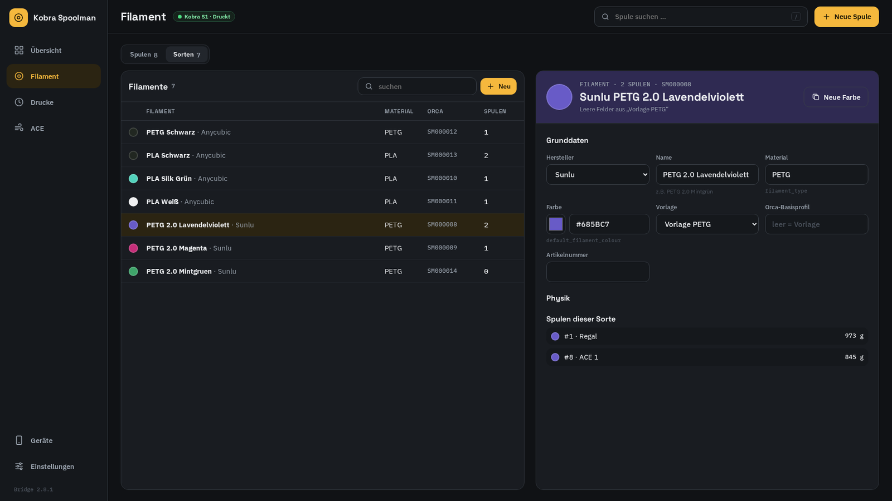
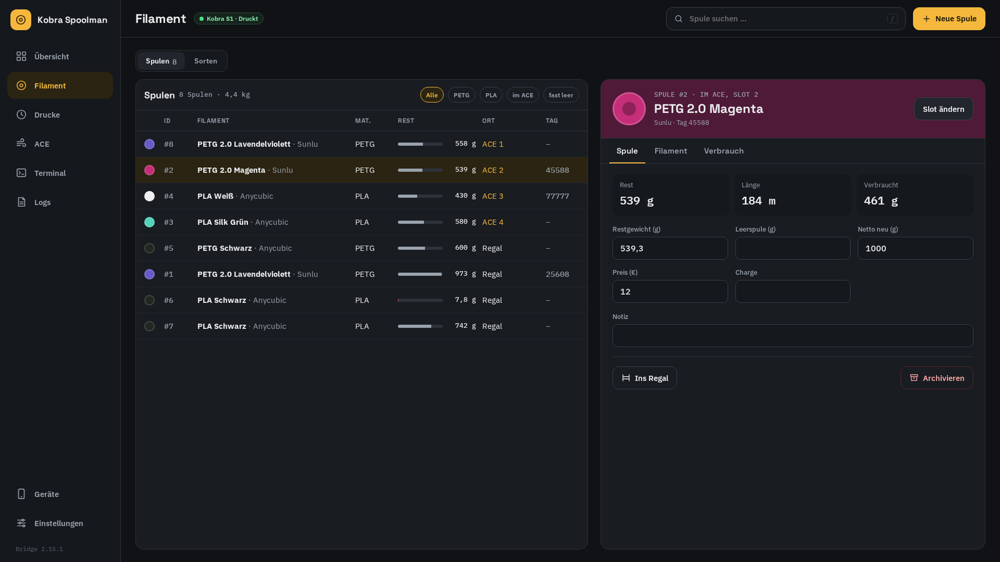
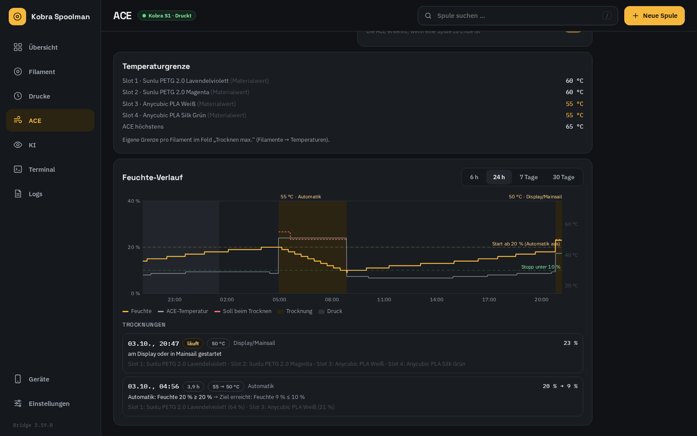
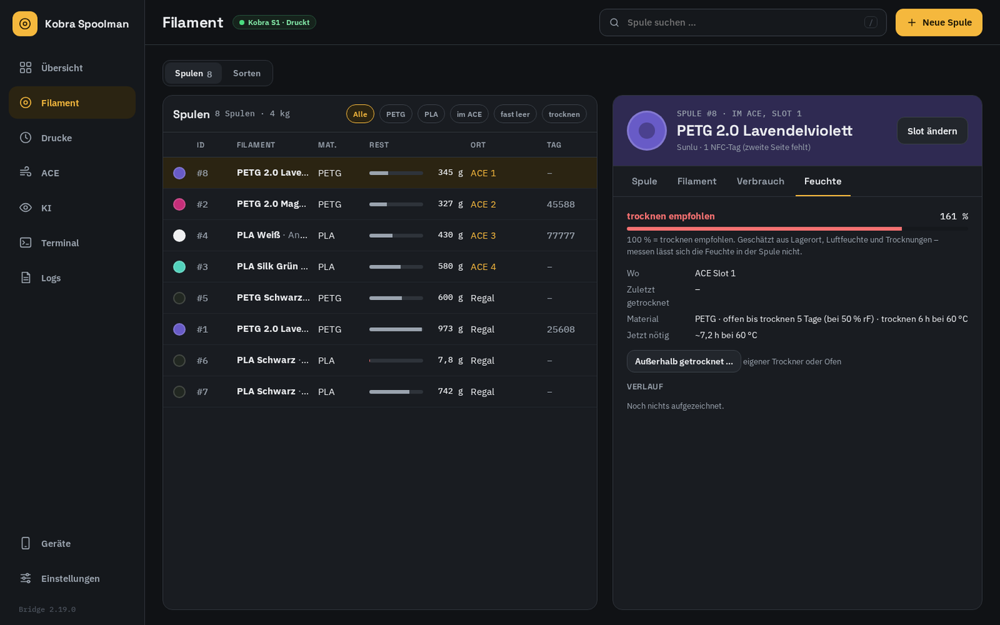
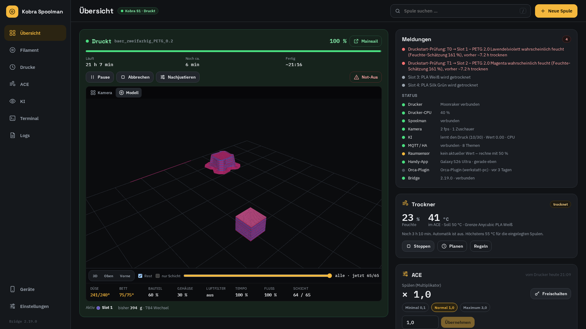
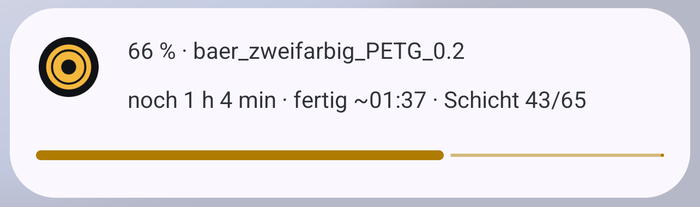
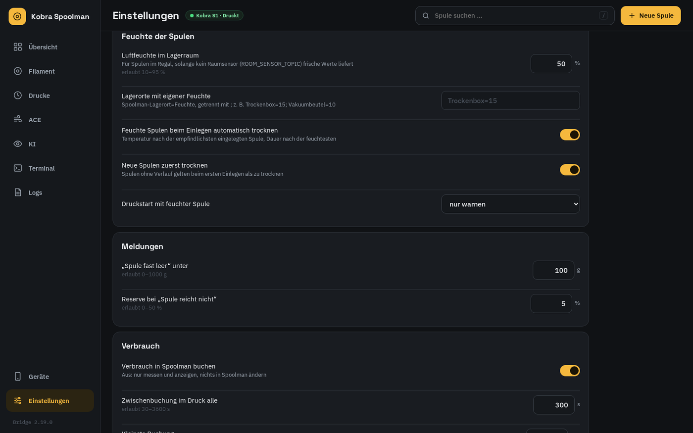
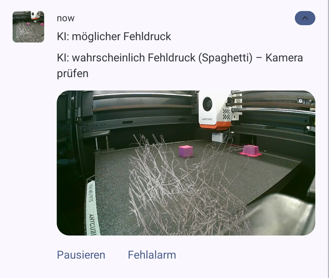
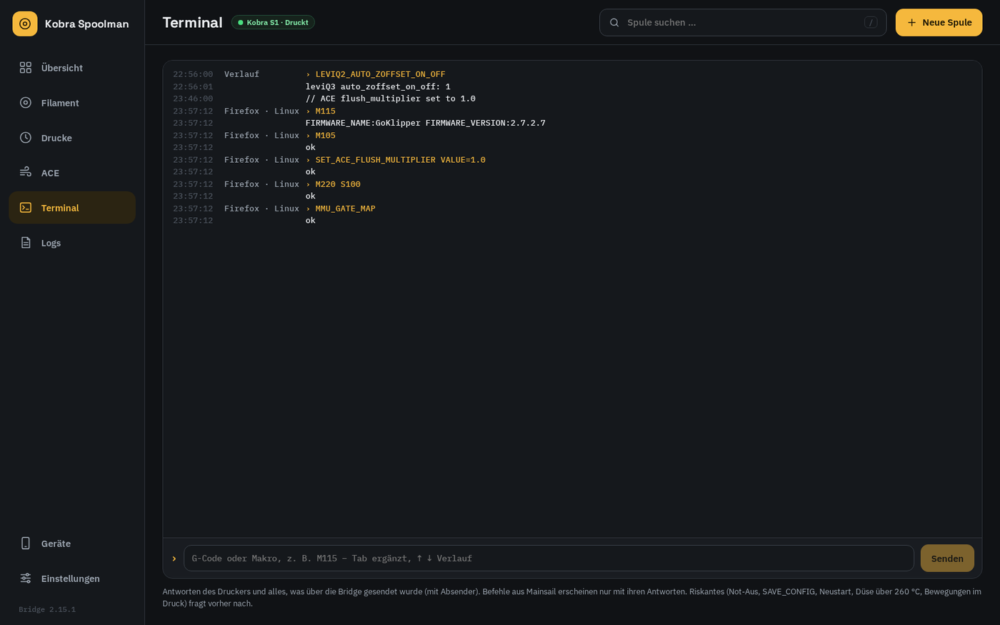

# Im Alltag

[English](../usage.md) · [Zurück zur README](../../README.de.md)

## Weboberfläche und App

Alles, was du am Drucker machst, läuft über die **Weboberfläche** (`http://<docker-host>:7913`) oder
die **Android-App**. Beide zeigen dieselben Daten der Bridge; die App kann zusätzlich NFC-Tags lesen
und schreiben. Spoolmans eigene Oberfläche brauchst du nur noch für Dinge, die die Bridge nicht
abdeckt (z.B. einen Hersteller umbenennen).

| Bildschirmbreite | Aufbau |
|---|---|
| Handy | Leiste unten: *Übersicht*, *Filament*, *Drucke*, *Mehr* |
| Desktop | Seitenleiste links: *Übersicht*, *Filament* (Spulen und Sorten), *Drucke*, *ACE*, *Terminal*, *Logs*, Geräte, Einstellungen |
| Ultrawide (ab 3000 px, z.B. 5120×1440) | die Übersicht passt auf einen Bildschirm: Drucker mit großer Kamera, Slots mit Trockner und ACE, Meldungen und Status |

Die **Übersicht** ist der Druckermonitor: Kamera (das Modell nur während eines Drucks), Druckstatus,
Druckerdaten, **Meldungen** und die vier Slots mit Trockner und ACE-Einstellungen. Spulen, Sorten
und die Druckhistorie verwaltest du auf eigenen Seiten.

**Meldungen** zeigt, nach Wichtigkeit, was Aufmerksamkeit braucht: Druck pausiert oder Fehler, Slot
ohne Material am Drucker, eine Spule, die **für den laufenden Druck nicht reicht** (die Bridge liest
die Druckdatei: was jedes Werkzeug noch druckt plus das Spülen der noch kommenden Farbwechsel, 5 %
Reserve), Spule fast leer (< 100 g), Buchungen noch nicht in Spoolman, Spoolman nicht erreichbar,
hohe Feuchte bei ausgeschalteter Automatik, ein gerade beendeter Druck. Darunter **Status**: Drucker,
Spoolman, Kamera (Bildrate, Zuschauer), gekoppelte App und Orca-Plugin (zuletzt gesehen) und die Bridge.

Tastatur (Desktop): `/` suchen, `n` neue Spule, `↑` `↓` Spule wählen, `Esc` schließen.
Rechtsklick auf eine Spule → in einen Slot legen, ins Regal, archivieren.

Die Weboberfläche fragt einmal pro Browser nach dem Koppeln ([Installation](installation.md#4-das-erste-gerät-koppeln)).
*Nur ansehen* überspringt das – alles ist sichtbar, Knöpfe, die etwas ändern, führen zum Koppeln.

## Ein neues Filament kommt

In der Weboberfläche unter **Filamente → Neu** anlegen, in der App über **Neu → Nicht dabei? Neues Filament**
oder direkt in Spoolman.

| Feld | Eintrag |
|---|---|
| Hersteller, Name | z.B. *Sunlu*, *PETG 2.0 Lavendel* – die Farbe gehört in den Namen |
| Material | `PLA`, `PETG`, `PLA Silk` … (der Grundtyp bestimmt den Orca-Filamenttyp) |
| Farbe | Hex-Farbe; bei Anycubic-Spulen die Farbe nehmen, die die ACE meldet, damit der Slot-Abgleich passt |
| Dichte, Durchmesser, Gewicht, Preis | vom Etikett / aus dem Shop |
| **Vorlage** *oder* **Orca-Basisprofil** | siehe unten |
| Alles andere | nur, was du abweichend willst – leere Felder zeigen den geerbten Wert grau als Platzhalter |

**Vorlage oder Basisprofil?**

- **Vorlage** (`Vorlage PETG`, …): allgemeine Startwerte, gepflegt in Spoolman. Passt für die meisten
  Fremd-Filamente. Leer lassen → die Vorlage wird nach Material gewählt.
- **Orca-Basisprofil**: der genaue Name eines Orca-Systemprofils, z.B.
  `Anycubic PLA Silk @Anycubic Kobra S1 0.4 nozzle`. Der Editor bietet die Namen an, die das
  Orca-Plugin gemeldet hat. Nimm es, wenn Orca schon ein abgestimmtes Profil mitbringt – die Vorlage
  wird dann komplett ignoriert.

Reihenfolge (später gewinnt): *Orca-Basisprofil* ← *Vorlage* ← *Filament-Felder* ← *Orca-Overrides*.
Feldübersicht: [spoolman-fields.md](../spoolman-fields.md) (englisch).

**Gleiches Produkt, andere Farbe:** Filament öffnen und **Neue Farbe** drücken – alle Werte werden
übernommen, du gibst nur Name und Farbe ein.

Das Orca-Plugin legt beim nächsten Orca-Start das Profil `Hersteller Name (SM0000xx)` an. Läuft Orca
schon? Im Panel **Profile aktualisieren** drücken, dann Orca neu starten. Orcas Filament-**Sync**-Knopf
setzt die Profile danach in die Filament-Felder (siehe unten).

## Eine neue Spule

**Neue Spule** (oben rechts oder `n`): Filament wählen, Gewichte prüfen (Vorgaben kommen vom
Filament), wahlweise **Gleich einlegen** in einen Slot. In der App kannst du vorher einen NFC-Tag
scannen – die neue Spule wird damit verknüpft, oder die App schreibt ihr einen ACE-tauglichen Tag
([android-app.md](../android-app.md), englisch).

## Spule in die ACE einlegen

Auf der Slot-Karte **Spule wechseln** (bei leerem Slot **Spule zuordnen**) drücken und die Spule
wählen. Spulen, die zu dem passen, was die ACE vom Tag liest, stehen oben und sind mit *passt* markiert.

**Spulen ohne Tag:** Die ACE kennt ihr Material nicht. Ordnest du so eine Spule zu, gibt die Bridge
Material, Farbe und Temperatur aus Spoolman an den ACE-Treiber (`ACE_SET_SLOT`; vor dem Einlegen zugeordnet:
sobald die Spule drin ist; während eines Drucks: danach). Nur die Zuordnung macht das; zum erneuten Senden
die Spule nochmal zuordnen. ACEPRO braucht die Werte für die Endlosspule und die Ladetemperatur.

Spule herausnehmen: Meldet die ACE einen Slot eine Weile als leer, kommt die Spule automatisch ins
Regal (während eines Drucks erst danach). Oder auf der Slot-Karte **Leeren** drücken.

**Spulen mit unseren Tags werden automatisch zugeordnet.** Liest die ACE einen unserer Sticker
(`AHPEBK-<nummer>`, Nummer ab 1000) in einem Slot, ordnet die Bridge die Spule mit dieser Tag-Nummer
zu – die bisherige kommt ins Regal, auch während eines Drucks (der Verbrauch läuft dann auf der neuen
Spule weiter). Auch eine Spule, die beim Start der Bridge schon steckt, wird erkannt. Die Slot-Karte
zeigt dann *RFID*. Eine unbekannte Nummer erscheint unter *Meldungen*; einmal von Hand zuordnen, und
die Bridge merkt sich die Nummer an der Spule (wenn sie noch keine hat). Original-Anycubic-Tags (102,
107, …) stehen für eine Sorte, nicht für eine Spule – die bleiben manuell. Eine Handzuordnung wird erst
überschrieben, wenn sich der Tag im Slot ändert.

## Spulen und Sorten

**Filament** hat zwei Ansichten, oben umschaltbar: **Spulen** und **Sorten**. Eine Sorte zeigt ihre
Spulen; Tippen öffnet die Spule unter *Spulen*.

**Spulen** zeigt alle aktiven Spulen mit Restgewicht, Ort und Tag-Nummer; filtern nach Material,
*im ACE* oder *fast leer* (< 200 g), oder suchen. Spule wählen, um sie zu bearbeiten:

- **Spule**: Restgewicht (nach dem Wiegen), Leerspule, Netto neu, Preis, Charge, Notiz und – bei
  Spulen im Regal – der Lagerort.
- **Filament**: der Filament-Editor, direkt dort.
- **Verbrauch**: erste und letzte Benutzung und jeder aufgezeichnete Druck mit dieser Spule.

## Trocknen (ACE-Trockner)

Die Trockner-Karte zeigt Feuchte und aktuelle Temperatur der ACE; beim Trocknen dazu das Soll, das
Filament, das die Grenze setzt, und die Restzeit. **Trocknen** / **Stoppen**
geht von Hand; **Regeln** stellt die Automatik ein: Start, wenn die Feuchte über eine Schwelle steigt
(Standard 20 %) – und *Warten* Minuten am Stück darüber bleibt (Standard 15), damit ein kurz geöffneter
Deckel nichts startet –, Stopp unter einer zweiten (Standard 10 %) oder nach einer Höchstdauer, danach eine
Pause; wahlweise auch während eines Drucks. Ein Durchgang **von Hand, geplant oder nach dem Einlegen einer
Spule** läuft immer die volle Zeit, egal wie trocken die ACE meldet; hört die ACE vorher auf, startet die
Bridge sie mit der Restzeit neu. Nur die Automatik stoppt bei niedriger Feuchte.

Die Temperatur liegt **nie über dem, was das empfindlichste eingelegte Filament verträgt** – Feld
*Trocknen max.* am Filament, sonst an der Vorlage, sonst ein vorsichtiger Wert pro Material
(PLA 55 °C, PETG 60 °C, TPU 55 °C, …) – und nie über dem, was die ACE kann (ACE 2 Pro 65 °C, ACE Pro 55 °C).
Wird beim Trocknen eine empfindlichere Spule eingelegt, senkt die Bridge die Temperatur sofort und
behält die Restzeit. Die Seite **ACE** listet die Grenze jedes Slots.

**Feuchte-Verlauf** (Seite ACE, in der App im Trockner-Fenster) zeigt die Feuchte der ACE über 6 h bis
30 Tage, die ACE-Temperatur, beim Trocknen das Soll, die Schwellen der Automatik gestrichelt und jeden
Druck und jede Trocknung als Fläche. Darunter jede Trocknung: wer sie gestartet hat (Automatik, von Hand,
geplant, Spule eingelegt, Display/Mainsail) und warum, ihre Temperaturen und die Feuchte vorher und nachher.

## Feuchte der Spulen

Wie feucht eine Spule wirklich ist, kann niemand messen – aber die Bridge weiß, wo sie war. Jede Spule
bekommt eine **Feuchte-Schätzung**: Sie steigt mit der Luftfeuchte um die Spule (ACE-Sensor, solange sie
eingelegt ist, sonst der Lagerraum) und sinkt beim Trocknen. 100 % heißt *trocknen empfohlen*. Wie schnell
ein Material Wasser zieht und wie lange es trocknen muss, kommt vom Material (offen bei 50 % rF: PLA ~14 Tage,
PETG ~5, ABS/ASA ~21, TPU ~2, PA/PVA weniger) und lässt sich pro Filament einstellen (*Offen bis Trocknen*,
*Trocknen Dauer*).

- **Eine Spule, die getrocknet werden sollte, wird eingelegt** – auch eine neue ohne Verlauf: Der
  ACE-Trockner startet von selbst, Temperatur nach der empfindlichsten eingelegten Spule, Dauer nach der
  feuchtesten.
- **Prüfung beim Druckstart:** Beim Start vergleicht die Bridge jedes Werkzeug der Datei mit seinem Slot –
  leerer Slot, anderes Material, deutlich andere Farbe, keine Spule zugeordnet oder Spule zu feucht – und
  zeigt es unter *Meldungen*. Standard ist nur warnen; *Druckstart mit feuchter Spule → Druck sofort
  pausieren* hält den Druck stattdessen einmal an.
- Die Spulenkarte hat den Reiter **Feuchte** mit Schätzung, Ort, letzter Trocknung und Verlauf;
  **Außerhalb getrocknet …** trägt eine Trocknung im eigenen Trockner ein. Die Spulenliste filtert auf
  *trocknen*.
- Für den Lagerraum rechnet die Bridge mit 50 % Luftfeuchte, bis ein **Raumsensor** über MQTT angebunden
  ist (siehe [Konfiguration](../configuration.md#home-assistant-mqtt)); Trockenboxen bekommen pro
  Spoolman-Lagerort einen eigenen Wert (`Trockenbox=15`).

## Einen Druck in 3D ansehen

Während eines Drucks zeigt **Modell** die Druckdatei in 3D wie OrcaSlicers Vorschau – grauer Hintergrund, die
Kobra-S1-Platte mit 10-mm-Raster, jede Bahn als beleuchteter Strang in echter Breite und Schichthöhe in den
Farben der eingelegten Spulen: Gedrucktes kräftig, der Rest wie unter *Rest* gewählt – *Durchsichtig*, *Voll*
(das ganze Modell in vollen Farben wie in Orca) oder *Aus* – und die Düsenposition live. Unter dem Bild zeigt
*Benutzt* die Slots, die die Datei braucht, mit Gesamtmenge und dem, was noch kommt (Spülen eingerechnet). Ziehen dreht, zwei Finger oder rechte Maustaste
verschieben, Mausrad oder Spreizen zoomt; *3D*, *Oben*, *Vorne* springen in eine Ansicht. Der
Schicht-Regler zeigt jede beliebige Schicht (*nur Schicht* nur diese, *Live* zurück zur laufenden). Wie
gezeichnet wird, hängt vom Gerät ab (*Einstellungen → Dieses Gerät → 3D-Modell*, in der App
*Einstellungen → 3D-Modell*): *Volumen* (schattierte Stränge), *Linien* (schont die Grafik), *Bild der
Bridge* (für schwache Geräte) oder *Automatisch*, das nach den Fähigkeiten des Geräts wählt.

## Einen Druck beobachten

Die Druckerkarte zeigt **Modell** – die Druckdatei, von der Bridge gezeichnet in den Farben deiner
eingelegten Spulen, Gedrucktes kräftig, der Rest als Schatten, mit aktueller Schicht – und **Kamera**,
die Druckerkamera live (nur auf gekoppelten Geräten), mit der Bildrate in der Ecke. Unter dem Bild:
Düse und Bett (ist/soll), Bauteil-, Gehäuse- und Luftfilterlüfter, Tempo und Fluss, Schicht –
geheizte Werte und veränderte Faktoren sind hervorgehoben. Bild antippen für Vollbild. Unter dem
Fortschrittsbalken: wie lange der Druck schon läuft, wie lange er noch ungefähr braucht und wann er
etwa fertig ist (*~17:35*, *morgen ~02:10*), geschätzt aus dem bisherigen Fortschritt.

Die Bridge **verteilt die Kamera weiter** (Restream): Egal wie viele Browser und Handys zuschauen, sie
holt die Bilder nur einmal vom Drucker – und nur solange jemand zuschaut. Die Bildrate (bis 10 fps)
richtet sich nach der Drucker-CPU; *gedrosselt* in der Ecke heißt, die Bridge hält sich zurück, damit
der Druck Vorrang hat. Damit Mainsail keinen zweiten
Stream öffnet, trag dort auch die Bridge ein: **Geräte → Kamera-Link** zeigt eine Stream- und eine
Einzelbild-Adresse. In Mainsail *Einstellungen → Webcams*, die Webcam bearbeiten, Dienst
*MJPEG-Streamer* wählen und die beiden Adressen einfügen. Der Link zeigt nur die Kamera; *Neu erzeugen*
ersetzt ihn (der alte funktioniert dann nicht mehr).

## Fortsetzen nach Stromausfall

Mit dem Klipper-Modul `kobra_resume` (nicht Teil dieses Repos) sichert der Drucker laufend die Stelle, die er wirklich
gedruckt hat. Nach einem Stromausfall zeigt die Übersicht **Druck unterbrochen** mit Live-Bild (die App meldet einen
Alarm): prüfen, ob das Teil noch fest auf dem Bett ist, dann **Fortsetzen** – der Drucker heizt das Bett, fährt X/Y nach
Hause, tastet die Höhe mit der Wiegezelle auf der zuletzt gedruckten Linie an (statt Z aufs Teil zu homen), spült und
druckt an der Stelle weiter, die erste Minute langsamer. Passt die getastete Höhe nicht, bricht er ab statt zu raten.
**Verwerfen** löscht die Sicherung. Ohne deine Bestätigung passiert nichts. Schalter: ACE-Seite → *Fortsetzen nach Stromausfall*.

## Verstopfung erkennen

Mit dem Klipper-Modul `kobra_clog` (nicht Teil dieses Repos) vergleicht der Drucker im Druck, wie viel Filament der
Extruder gefördert hat, mit dem, was der Encoder am Filament-Eingang gesehen hat. Sieht der Encoder zweimal hintereinander
viel zu wenig, zeigen Übersicht und App **Verstopfung?** mit den Zahlen – Düse und Filamentweg prüfen. Standard ist nur
warnen; ACE-Seite → *Verstopfung erkennen* schaltet es aus oder auf *Pausieren*. Werkzeugwechsel werden nicht geprüft (dort
bewegt die ACE das Filament selbst).

## Z-Versatz pro Filament

Manche Filamente wollen die erste Schicht etwas höher oder tiefer (z. B. PETG). In Spoolman als **Z-Versatz** (mm,
+ = weiter weg vom Bett) am Filament oder an seiner Vorlage eintragen; die Bridge gibt die Werte der eingelegten Slots an
den Drucker, und der Druckstart rechnet den Wert des Startfilaments zur ersten Schicht dazu (in der Konsole als
`Filament T0 +0.020`). Leer = 0. Aus: *Einstellungen → Erste Schicht* oder `use_filament_z: False` in `KOBRA_START`.

## Pressure Advance (Auto-PA)

Mit dem Klipper-Modul `kobra_pa` (nicht Teil dieses Repos) misst der Drucker Pressure Advance mit der Wiegezelle im
Kopf wie Anycubics Original-Firmware, aber nur einmal pro Filament: Hat das Filament eines Slots in Spoolman noch kein
PA, misst der Drucker beim Druckstart bzw. nach dem Farbwechsel (~2 Minuten, etwa 120 mm in den Abfallschacht). Die
Bridge speichert das Ergebnis am Filament – eine Tabelle mit K je Geschwindigkeit (*PA-Tabelle*) und K bei 200 mm/s in
*Pressure Advance*, das auch Orcas Profil übernimmt. Klipper wendet K je Bewegungsgeschwindigkeit an.

Die Karte **Pressure Advance** auf der ACE-Seite (App: ACE-Fenster) zeigt K je Slot und hat zwei Schalter, die im
Drucker gespeichert sind: **Auto-PA** (aus = Klipper nimmt das PA aus Orca) und **Automatisch messen**. *Messen* misst
den geladenen Slot sofort (nicht im Druck), *Neu messen* löscht den Wert, damit der nächste Druck neu misst. Ein von Hand
eingetragener Wert (Spoolman oder Orca) gilt als festes PA und wird nicht gemessen; PA in Orca geändert ersetzt eine
Messtabelle. Eine gescheiterte Messung hält den Druck nie an – es geht mit dem bisherigen PA weiter.
*Einstellungen → Pressure Advance* schaltet die Verbindung zu Spoolman ganz ab.

## ACE-Einstellungen

Die Seite **ACE** (App: Trockner-Karte antippen) zeigt, was das Druckerdisplay versteckt:

- **Endlosspule** – ist eine Spule leer, lädt die ACE eine passende andere und der Druck läuft weiter.
  *Welche Spule passt?*: gleiche Farbe und gleiches Material, gleiches Material oder einfach die nächste
  Spule. Auch während eines Drucks änderbar; gilt beim nächsten leeren Slot. Der Verbrauch läuft auf dem
  neuen Slot weiter.
- **Trocknen planen** – ein Start zu einer festen Zeit, z.B. heute um 22:00.
- **Pressure Advance**, **Fortsetzen nach Stromausfall** und **Verstopfung erkennen** – die Schalter der
  Klipper-Module am Drucker, siehe die Abschnitte unten. Jede Karte erscheint nur, wenn der Drucker das
  Modul hat; jeder Schalter wird im Drucker gespeichert.

Die Spülmenge pro Farbwechsel stellst du in Orca ein (Spülmengen neben *Filament*); der Filamentwechsel-G-Code
des Druckerprofils gibt sie an den ACE-Treiber, siehe [Installation](installation.md#orca-druckerprofil).

## Slicen und Drucken

1. In Orca den Filament-**Sync**-Knopf drücken. Mit dem orca-kobra-Build werden die `SM…`-Profile für
   Slot 1–4 automatisch gewählt; das Panel zeigt pro Slot *Filament N in Orca: passt* und warnt, wenn
   ein Filament-Feld nicht zum Slot passt.
2. Slicen. Oben im Panel zeigt **Geplanter Verbrauch** eine Zeile pro Slot: *Bedarf / Rest g* und
   ✓ (reicht), ⚠ (*knapp*) oder ✗ (*reicht nicht*). Reicht eine Spule nicht, warnt auch Orca.
   *Details* klappt die Aufschlüsselung auf (unten).
3. Wie gewohnt drucken (Printer Agent *Moonraker*).
4. Während des Drucks zeigen Druckerkarte und Slot-Karten den bisherigen Verbrauch (*dieser Druck*).
   Die Bridge bucht bei jedem Farbwechsel, alle 5 Minuten und am Ende in Spoolman. Fertige Drucke
   stehen unter **Drucke** mit Gramm pro Spule.

Pause, Abbrechen und Nachjustieren gehen auf der Druckerkarte ([unten](#einen-druck-steuern));
Dateien, Makros und Druck starten bleiben in Mainsail/Fluidd (*Mainsail* auf der Druckerkarte).

### So wird die Verbrauchsvorschau berechnet

Die Tabelle unter *Details* ist Orcas eigene Vorschau-Legende (Vorschau → Filament), alle Werte in Gramm.

| Spalte | Quelle |
|---|---|
| *Modell*, *Stützen*, *Gereinigt*, *Turm*, *Gesamt* | Modell, Stützen, Spülen und Reinigungsturm pro Filament, *Gesamt* ist die Summe; leere Spalten fehlen wie in Orca. *Gereinigt* enthält das Laden (85 mm) und Spülen der ACE bei jedem Farbwechsel – das Druckerprofil meldet es Orca (`EXTERNAL_PURGE`). Fehlt es, obwohl der Druck die Farbe wechselt, sagt das Panel Bescheid. |
| *Rest* | Restgewicht der dem Slot zugeordneten Spule, aus Spoolman |

Filament N in Orca zählt gegen Slot N – dieselbe Zuordnung, die der Sync-Knopf setzt. Die Vorschau
braucht den orca-kobra-Build (Patch 0003); sie verschwindet, wenn das Slice-Ergebnis nicht mehr gilt
(Modell oder Einstellungen geändert).

## Offene Posten

Wurde ein Slot ohne zugeordnete Spule benutzt oder seine Spule gelöscht, bleibt der Verbrauch als
**offener Posten** stehen (Karte *Offene Buchungen*, Zahl bei *Drucke*). **Buchen** drücken und die
Spule wählen, oder **Verwerfen**. War Spoolman nicht erreichbar, holt die Bridge die Buchung selbst nach.

## Ein Profil in Orca ändern

Ein `SM…`-Profil ändern und speichern. Das Plugin fragt *Nach Spoolman übernehmen?*:

- **Ja** – bekannte Werte landen in ihren Spoolman-Feldern, alles andere in *Orca-Overrides*.
- **Nein** – der nächste Sync setzt das Profil auf die Spoolman-Werte zurück (Spoolman bleibt die Quelle).

Dafür muss das Plugin gekoppelt sein; sonst sagt es Bescheid. Um für einen einzelnen Wert zur Vorlage
zurückzukehren, das Feld im Filament-Editor leeren (oder `POST /api/orca/reset`, siehe [api.md](../api.md)).

## Wenn ein Filament leer ist

**Archivieren** an der Spule (Regal, App oder Spoolman). Filamente ohne aktive Spule verlieren beim
nächsten Sync ihr Orca-Profil; Profile, die das Plugin nicht selbst angelegt hat, bleiben unangetastet.

## Einen Druck steuern

Unter dem Druckstatus (Weboberfläche und App, nur gekoppelt): **Pause** / **Weiter**, **Abbrechen**
(fragt nach, ein abgebrochener Druck lässt sich nicht fortsetzen), **Nachjustieren** – Tempo, Fluss,
die drei Lüfter und die Solltemperatur von Düse und Bett, auch ohne Druck (z. B. zum Vorheizen) – und
**Not-Aus**: zwei Sekunden gedrückt halten, dann bestätigen. Nach einem Not-Aus (oder einem Klipper-Fehler)
zeigt die Leiste **Klipper neu laden** (`FIRMWARE_RESTART`, fragt nach); danach die Achsen neu referenzieren.

## Das Display des Druckers

`http://<docker-host>:7913/display` ist eine Ansicht für den Touchscreen des Kobra S1 (800×480, Finger): ein
Kiosk-Browser auf dem Klipper-Pi zeigt sie auf dem Original-Display (Einrichtung außerhalb dieses Repos). Leiste
links: *Start*, *Druck*, *Schalter* und das Licht.

- **Start** – Düse, Bett, ACE-Feuchte, die vier Slots mit Spulenfarbe und Gewicht, der Trockner.
- **Druck** – kommt bei Druckstart von selbst: Vorschaubild der Datei, Fortschritt, Schicht, Zeiten (läuft, Rest,
  fertig um), Temperaturen, Tempo und Fluss, die benutzten Slots; Pause/Weiter, *Nachjustieren* (Tempo, Fluss),
  Abbrechen (mit Rückfrage).
- **Schalter** – alle Schalter der Klipper-Module am Drucker in drei Reitern (*Drucken*, *Überwachung*,
  *Licht & Töne*) und die KI. Gespeichert im Drucker, Weboberfläche, App und Mainsail zeigen denselben Stand.
- Nach einem Stromausfall fragt der ganze Bildschirm, ob fortgesetzt werden soll ([siehe oben](#fortsetzen-nach-stromausfall)).

Lesen geht ohne Schlüssel; zum Schalten wird das Display einmal gekoppelt wie jedes Gerät: unter
*Geräte → Gerät hinzufügen* einen Code erzeugen und am Ziffernfeld des Displays eintippen.

## Benachrichtigungen aufs Handy

Die App überwacht den Drucker im Hintergrund und ersetzt den OctoApp-Companion (der am Kobra S1 etwa zwei
Drittel der Drucker-CPU brauchte). Sie fragt nur die Bridge, der Drucker merkt davon nichts.

- **Während eines Drucks** ist der Druck ein *Live-Update* (ab Android 16): immer ganz oben, auf dem
  Sperrbildschirm und als *48 %* in der Statusleiste, mit Fortschritt, Restzeit, Fertig-Uhrzeit und Schicht.
  Ein Bild erlaubt Android dort nicht; auf älteren Handys oder wenn du Live-Updates für die App abschaltest,
  ist es eine normale Benachrichtigung mit Kamerabild.
- **Eigene Töne**, damit du sie von anderen Apps unterscheidest: Druck gestartet, erste Schicht fertig,
  Druck fertig, Alarm, Hinweis.
- **Alarm** (mit Kamerabild): Druckerfehler, Pause oder Abbruch, die nicht von dir kamen (eine Pause aus
  Weboberfläche oder App ist kein Alarm), hängender Farbwechsel, fallende Düsentemperatur, Drucker oder
  Bridge weg im Druck, Spule reicht nicht, unterbrochener Druck nach Stromausfall, Verdacht auf Verstopfung.
- **Hinweis**: nur, was du tun kannst – unbekannter Tag im Slot, Slot ohne Material, Spoolman länger als
  5 Minuten weg. Drucker-CPU, *fast leer*, offene Buchungen und Feuchte bleiben unter *Meldungen* in der App.

*Einstellungen → Töne* spielt jeden Ton ab und schickt pro Art eine Probe-Benachrichtigung (prüft Lautstärke
und *Nicht stören*). Abschalten unter *Einstellungen*; jede Art ist ein eigener Kanal in den
Android-Einstellungen der App.

**Widget:** *Einstellungen → Widget auf den Startbildschirm* legt den Druck auf den Startbildschirm –
Kamerabild, Fortschritt, Rest- und Fertig-Zeit; Antippen öffnet die App.

## Einstellungen

*Einstellungen* in der Weboberfläche ändert die Bridge im laufenden Betrieb – Kamera, Druckvorschau, Slots
und RFID, Feuchte der Spulen, Meldungen, Verbrauch, Daten – ohne Neustart und ohne Portainer. Die Umgebung
des Stacks gibt nur die Startwerte; *zurücksetzen* stellt sie wieder her. Siehe
[Konfiguration](../configuration.md#changing-settings-at-runtime). Unten listet *Neu in der Bridge* die Änderungen
der letzten zehn Versionen (alle: [Changelog](../../CHANGELOG.md), englisch).

## Home Assistant

Mit `MQTT_HOST` schickt die Bridge Drucker, Slots, ACE, Meldungen und KI an deinen MQTT-Broker, und Home
Assistant legt das Gerät *Kobra S1 (ace-lane-bridge)* von selbst an – der Drucker bekommt keinen weiteren
Client. Details in der [Konfiguration](../configuration.md#home-assistant-mqtt).

## KI-Fehldruck-Erkennung

Läuft [kobra-vision](../vision.md) (englisch), schickt die Bridge im Druck alle 10 s ein Kamerabild an die
KI und verfolgt den Wert über den Druck. Wird ein Druck zu Spaghetti, kommt die rote Meldung
**KI: wahrscheinlich Fehldruck** – in der Weboberfläche mit **Fehlalarm** / **Stimmt**, am Handy als Alarm
mit Kamerabild und **Pausieren** / **Stimmt** / **Fehlalarm**. Im Kamerabild stehen die Fundstellen als Rahmen.
*Fehlalarm* schaltet die KI für den Rest des Drucks still. Die ersten ~5 Minuten eines Drucks melden nie.
Standardmäßig warnt die KI nur; selbst pausieren kann sie, sobald du ihr traust (`VISION_ACTION=pause`).
Die Bilder werden gesammelt (bis 5 GB), damit die nächsten Stufen lernen können: Platte prüfen und
umgefallene Teile.

Gesteuert wird alles im Tab **KI**: Empfindlichkeit, melden oder pausieren, Ruhezeiten, ignorierte
Bereiche (z. B. die Spülrutsche), die Grundlinie, alle Ereignisse und die Bildersammlung zum
Kennzeichnen, Löschen oder Herunterladen – Details in [vision.md](../vision.md#the-ki-tab) (englisch).
In der App: *Mehr → KI*.

## Terminal und Logs

**Terminal** zeigt, was der Drucker antwortet, und jeden Befehl, der über die Bridge ging – mit
Absender (ein Browser, der Trockner, die ACE-Karte, eine Slot-Zuordnung). Gib G-Code oder ein Makro
ein: `Tab` ergänzt aus der Befehlsliste des Druckers, `↑` `↓` blättern im Verlauf. Riskantes –
Not-Aus, `SAVE_CONFIG`, Neustarts, Düse über 260 °C, Bewegungen während eines Drucks – fragt vorher
nach. Senden geht nur auf gekoppelten Geräten.

**Logs**: *Bridge* ist das Log der Bridge (Filter nach Stufe, Suche, Download – kein Umweg über
Portainer); *Drucker* zeigt das Ende der Logdateien des Druckers (`moonraker.log`, …; nur die letzten
200 KB, auf Wunsch mehr); *Druck-Aufzeichnungen* sind die Rohdaten jedes Drucks zum Herunterladen.

## Geräte

**Geräte** listet jeden gekoppelten Browser, jedes Handy und Orca-Plugin mit dem Zeitpunkt der letzten
Nutzung. **Gerät hinzufügen** zeigt Code und QR-Code für ein neues Gerät; **Entfernen** sperrt einen
Schlüssel sofort (z.B. bei einem verlorenen Handy). *Entkoppeln* beim eigenen Browser vergisst dessen Schlüssel.
