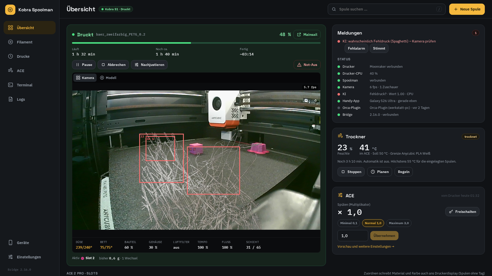
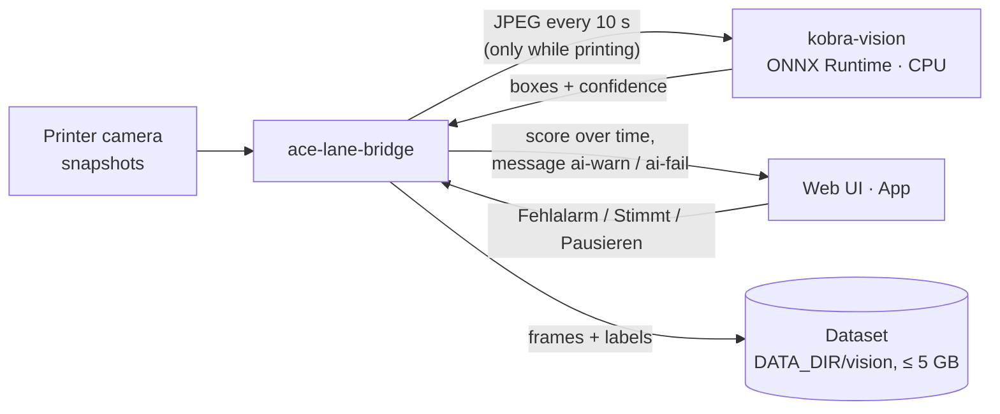

# AI print-failure detection (kobra-vision)

[Back to README](../README.md) · [Configuration](configuration.md#ai-print-failure-detection) · [API](api.md#ai-print-failure-detection)

The bridge watches running prints with a small AI service and raises an alarm with a camera picture
when a print turns into spaghetti. It replaces Obico/OctoApp's failure detection without any extra
load on the printer.

<p align="center"></p>

## How it is built



| Part | Where | What it does |
|---|---|---|
| **kobra-vision** | [`vision/`](../vision) — own container, **AGPL-3.0** | Stateless HTTP service: `POST /v1/detect` with a JPEG → boxes with confidence. Loads the model on the first picture and unloads it after `UNLOAD_AFTER_S` without pictures (no print → no memory used). |
| **Bridge** | [`acebridge/vision.py`](../bridge/app/acebridge/vision.py) — MIT | Takes the pictures, judges them over time, raises the message, stores frames and your feedback, optional pause. |
| **Web UI / app** | | Boxes over the camera image, *Fehlalarm* / *Stimmt* on the message; the app's alarm has a camera picture and the buttons *Pausieren* / *Fehlalarm*. |

**The printer never notices.** The bridge already holds the camera; for the AI it reuses the newest
frame if someone is watching, otherwise it fetches one single snapshot (it does not start the
restream pump). One picture every 10 s, only in state `printing`.

**CPU is enough.** Obico's model (YOLO, 416×416, 192 MB) needs about **50 ms per picture with 2 threads**
on a desktop CPU (Ryzen 7 9800X3D, ONNX Runtime 1.30) — at one picture every 10 s that is far below 1 %
of one core. A VM CPU is slower, but even 500 ms would not matter. A Nvidia GPU (e.g. a Quadro P1000)
works too (`onnxruntime-gpu`, see below) but is not needed.

## The model

Stage 1 uses the **failure model of [Obico](https://github.com/TheSpaghettiDetective/obico-server)**
(the former *The Spaghetti Detective*), trained on a large set of real failed prints. Obico publishes it
as ONNX (`ml_api/model/model-weights.onnx.url` / `.sha256`). It is not in this repository: the Docker
image downloads it while building and checks the SHA-256 (`vision/fetch_model.py`). Because kobra-vision
runs Obico's model and the same post-processing, the service is licensed **AGPL-3.0** like obico-server;
the bridge only talks to it over HTTP and stays MIT.

## How a print is judged

A single picture is noisy (reflections, the purge line, a prime tower). The bridge judges the sum of
the confidences `p` per picture over time, with Obico's method and parameters
(`backend/lib/prediction.py`, implemented independently in `vision.py`):

- `ewm`: exponentially weighted mean of `p` (span 12 pictures),
- `short`: mean over this print (≤ 310 pictures), `long`: baseline over all prints (≤ 7200 pictures,
  survives restarts in `vision/state.json`),
- the first **30 pictures** of a print (~5 min) never alarm — first layer, purge, wiping,
- **warn** (*verdächtig*) when `ewm − long` is above 0.38 and clearly above this print's own level,
  or above 0.78; **fail** (*wahrscheinlich Fehldruck*) with the same test divided by 1.75.

So a sudden rise alarms, a constant pattern (e.g. a textured plate) does not. In the test environment
a spaghetti picture after a clean start gave *verdächtig* after 2 and *Fehldruck* after 4 pictures —
with 10 s per picture **20–40 s** after the spaghetti appears.

`VISION_SENSITIVITY` multiplies the score (1.0 = Obico's default; 1.5 = more sensitive).

## What you see

- **Message** `KI: Druck sieht verdächtig aus` / `KI: wahrscheinlich Fehldruck (Spaghetti)` (red), in
  the web UI with **Fehlalarm** and **Stimmt**.
- **App alarm** (own alarm sound, camera picture) with **Pausieren** and **Fehlalarm**; *Fehldruck*
  replaces an earlier *verdächtig* notification.
- **Boxes** with their confidence over the camera image (web UI).
- **Status line** *KI*: `lernt den Druck (12/30)`, `unauffällig · Wert 0.05 · CPU`, `verdächtig`,
  `Fehldruck?`, `für diesen Druck stumm (Fehlalarm)`, or a warning if the service is unreachable.

**Fehlalarm** silences the AI for the rest of this print and labels the picture as a negative example.
**Stimmt** labels it as a real failure. **Pausieren** (app) pauses the print and labels it as real.

`VISION_ACTION=warn` (default) only reports. With `VISION_ACTION=pause` the bridge pauses the print
itself on *Fehldruck* — switch this on once a few weeks without false alarms have passed.

## Data collection (for stages 2 and 3)

`DATA_DIR/vision/jobs/<start>_<file>/` per print: a picture at the start, every
`VISION_SAVE_EVERY_S` (60 s), every suspicious picture (`p` > 0.076), every alarm and one at the end;
`frames.jsonl` with time, `p`, boxes, layer and progress; `labels.jsonl` with your feedback. Above
`VISION_DATASET_GB` (5 GB) the oldest prints are deleted first. At ~250 KB per picture and one per
minute a 3-hour print takes ~50 MB — 5 GB hold roughly the last 100 prints.

## Next stages (planned)

| Stage | What | How |
|---|---|---|
| 1 | Spaghetti / detached print | ✅ Obico's model (this page) |
| 2 | **Plate check**: plate not empty before the start, part still there after the end | Compare the start picture of a print with a reference of the empty plate, only inside the plate area (the bed is at the same height at every start). Needs the collected start/end pictures to set the threshold. |
| 3 | **Prime tower or part knocked over / detached** | A small own classifier (e.g. MobileNet-sized, ONNX) trained on the collected and labelled pictures — runs on the CPU or the P1000 inside kobra-vision as a second model. |

## Set it up

Add the service to the bridge's stack (Portainer) and point the bridge at it:

```yaml
services:
  kobra-vision:
    image: ghcr.io/xnovosx/kobra-vision:latest
    container_name: kobra-vision
    restart: unless-stopped
    environment:
      THREADS: "2"
      UNLOAD_AFTER_S: "600"

  ace-lane-bridge:
    environment:
      VISION_URL: "http://kobra-vision:7917"
```

The KI status line should show *bereit · CPU* after a few seconds.

**With a Nvidia GPU** (optional): build the image with `--build-arg ORT=onnxruntime-gpu`, run it with
the Nvidia container runtime (`deploy.resources.reservations.devices: [{driver: nvidia, count: 1,
capabilities: [gpu]}]`) and `USE_GPU: "true"`. ONNX Runtime's CUDA build needs CUDA 12 / cuDNN 9 and a
recent driver; the status line then shows *Grafikkarte*.

### kobra-vision settings

| Variable | Default | Meaning |
|---|---|---|
| `THREADS` | `2` | CPU threads per picture |
| `UNLOAD_AFTER_S` | `600` | unload the model after this long without a picture |
| `USE_GPU` | `false` | use CUDA if `onnxruntime-gpu` is installed |
| `VISION_TOKEN` | – | if set, the bridge has to send the same `VISION_TOKEN` |
| `HTTP_PORT` | `7917` | |
| `MODEL_PATH` | `/models/obico-failure.onnx` | |

## Test environment

Without a printer (used to build this): the demo printer serves a switchable camera picture
(`tools/demo/camimg.txt`), kobra-vision runs from a venv, the demo bridge sends a picture every 2 s.
Test pictures: a clean Kobra S1 camera frame and failed prints from Wikimedia Commons
([CC0](https://commons.wikimedia.org/wiki/File:Spaghetti_monster.jpg),
[CC BY-SA 4.0](https://commons.wikimedia.org/wiki/File:Nieudany_wydruk_3D_01.jpg)); they stay out of the
repository. Results with the real model:

| Picture | Boxes | Sum `p` |
|---|---|---|
| Kobra S1, clean print | 0 | 0.00 |
| Spaghetti photo (CC0) | 18 | 3.31 |
| Failed print photo (CC BY-SA) | 19 | 5.23 |
| Kobra S1 camera with spaghetti composited in | 10 | 1.97 |
| Same, spaghetti only as flat coloured lines | 2 | 0.25 |

The last row shows the limit: the model reacts to real, three-dimensional tangles — the closer the
camera sees them, the better. `vision/tests` checks the post-processing without the model; with
`MODEL_PATH` and `TEST_IMAGES` set it also runs the real model.
